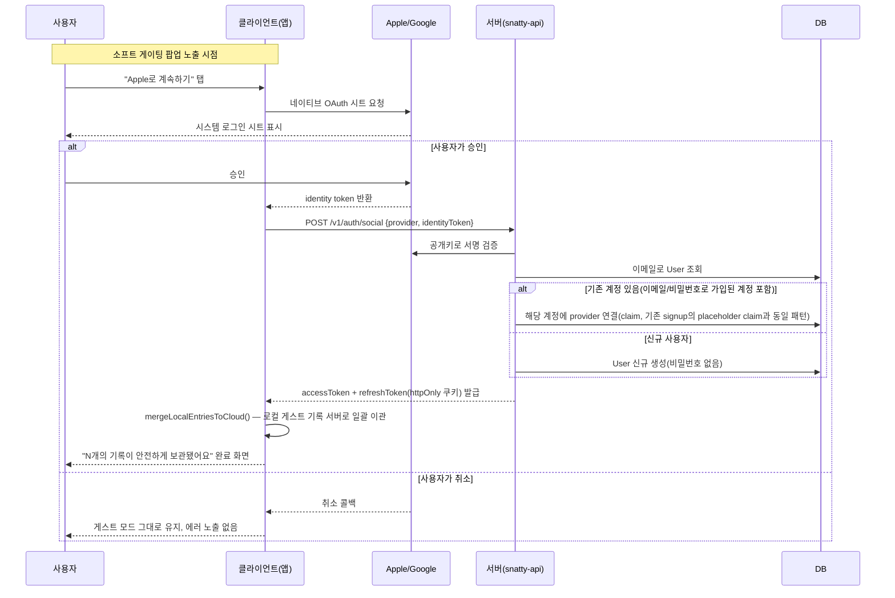

# 전체 진행 현황 체크리스트

> 마지막 갱신: 2026-09-06 — 디자인 제외하고 지금 바로 할 수 있는 것 중 가장 시급한 2가지(DB 백업 실제 검증, 프로덕션 에러 추적)를 처리했습니다.
> - **DB 백업→복구 실제 리허설, 그 과정에서 실제 버그 발견·수정** — 상세는 아래 `DATA-INTEGRITY` 섹션. 요약: 2026-07-16엔 백업 스크립트를 "만들기만 하고" 완료 처리했었는데, 이번에 실제로 백업→DB 완전 삭제→복구까지 돌려서 데이터가 정확히 돌아오는 걸 확인했고, 그 과정에서 로컬 백업 도구 버전이 실제 운영 DB(Neon, Postgres 18)보다 낮아서 지금까지 운영 DB는 백업 자체가 실패했을 것이라는 사실을 발견해 즉시 수정
> - **프로덕션 에러 추적(Sentry) 연동** — 지금까진 서버·클라이언트 어디서 에러가 나도 알 방법이 없었음. `@sentry/nextjs`(프론트)와 `@sentry/node`(서버) 연동, DSN 미설정 시 완전히 no-op이라 Sentry 계정을 아직 안 만든 지금도 빌드·테스트 정상 동작 확인. **Sentry 계정 생성·DSN 발급은 외부 서비스 가입이라 직접 해주셔야 함** — 발급 후 환경변수만 넣으면 바로 수집 시작
> 2026-09-04 — Figma에서 진행 중인 "기록하기" 플로우 개편 시안을 검토하고, 그중 화면 디자인과 분리해 먼저 만들 수 있는 부분(텍스트 자동 추천 로직)을 미리 구현했습니다.
> - **Figma "기록하기_온보딩" 탐색 보드 검토** — 사용자가 작업 중인 새 기록 플로우 시안 확인. 지금은 "할 일인가요?" 토글을 먼저 켜야 하고 감정도 수동으로 골라야 하는데, 새 시안은 일단 자유롭게 쓰면 시스템이 텍스트를 보고 감정/할 일 여부를 자동 추론해 인라인으로 제안하는 방향(맞으면 그대로, 아니면 수정). 완료 화면도 텍스트 두 줄에서 카드 캐러셀로 개편 검토 중. 다만 이 흐름을 그대로 구현하려면 텍스트 분석 기능이 필요한데 `AI-PIPELINE`이 아직 스텁뿐이라, 디자인은 사용자가 개선 버전을 다시 공유할 때까지 **현재 화면 그대로 유지**하기로 함
> - **텍스트 → 감정/할 일 자동 추천 로직 선행 구현** — 화면과 완전히 분리된 순수 함수(`src/app/lib/recordSuggest.ts`)로, 화면이 확정되기 전에도 미리 만들고 검증할 수 있는 부분만 먼저 처리. 지금은 키워드 기반 규칙으로 판단(예: "내일"+"챙길" → 할 일, "좋았다" → 행복). 일기 내용을 외부 LLM에 보내는 건 개인정보 정책 결정이 먼저 필요해 보류했고, 나중에 사용률이 올라가 정확도가 부족해지면 그때 LLM으로 교체하거나 애매한 경우만 LLM에 넘기는 방식으로 확장 가능하도록 반환 형태를 설계해둠. 프론트엔드에 테스트 러너(`vitest`)가 없었어서 서버와 같은 버전으로 새로 설치, 실제 문장으로 검증하는 테스트 12건 작성 + Storybook에 문장을 직접 입력해 결과를 바로 볼 수 있는 미리보기 추가 — 화면(`page.tsx`)에는 아직 연결하지 않음
> 2026-08-14 — Vercel 배포판을 실제로 써보다가 발견된 문제 2가지를 처리했습니다.
> - **"저장이 느리다" 신고 → 코드 버그였음**: 기록 저장 시 로컬 저장이 끝났는데도 서버 동기화가 끝날 때까지 기다렸다가 "저장 완료" 화면을 보여주고 있었음(지금은 로그인 UI가 없어 서버 동기화가 항상 실패하는데, 그 실패를 매번 기다린 셈). 로컬 저장 직후 바로 화면을 전환하고 서버 동기화는 화면과 무관하게 백그라운드에서 진행하도록 수정 — 저장이 즉시 반응하게 됨
> - **날씨 위치가 "API 미설정"으로 나오는 문제 확인 중, 카카오 역지오코딩을 둘러싼 오해가 있었음을 발견**: 처음엔 "실제로 발급받은 적 없는 키"라고 판단해 관련 코드를 통째로 제거했다가, 사용자가 "OpenWeatherMap 키만으로도 한글 주소가 나왔었다"고 알려주셔서 다시 확인 — 실제로 OpenWeatherMap API를 직접 호출해보니 날씨 상태(예: "흐림")만 한글로 나오고 지역명은 로마자("Jamwon-dong")로만 나온다는 게 확인됨. 시·구·동 단위 한글 지역명은 카카오 없이는 애초에 불가능한 기능이었다는 뜻이라, 같은 날 코드를 다시 복원했습니다 — 실제 한글 지역명을 보려면 카카오 개발자센터에서 키를 새로 발급받아야 함(안내드림)
> - 날씨 API "미설정" 자체의 원인은 별개였음: 로컬 `.env.local`의 `OPENWEATHERMAP_API_KEY`가 Vercel에는 자동으로 안 넘어가는 게 원인 — Vercel 프로젝트 환경변수에 직접 등록하도록 안내
> - **[해결]** 사용자가 카카오 REST API 키를 새로 발급받아 로컬·Vercel에 등록했으나 계속 로마자 지역명만 나옴 — 응답에 진단 정보를 임시로 노출시켜 원인 확인: Kakao Developers 콘솔에서 "카카오맵" 서비스가 꺼져있어 403(`OPEN_MAP_AND_LOCAL` 비활성)으로 매번 실패하고 있었음. 서비스 활성화 후 로컬·배포판 모두 실제 한글 주소("서울 서초구 서초동") 정상 반환 확인, 진단용 임시 코드는 확인 직후 제거
> - **[정책 전환] 비회원 로컬 저장 정책 재검토.** "저장됨 · 서버 연결 실패" 토스트가 계속 뜨는 이유를 사용자가 물어봐서 확인하는 과정에서, 이걸 "정책상 로그인 필수"로 오해하고 계셨던 게 드러남 — 실제 기록된 정책(2026-07-22 "비로그인도 영구 지원")은 정반대였고, 그 결정이 사용자가 실시간으로 승인한 건지 문서만으론 확인 안 되는 문제도 함께 드러남(카카오 건과 같은 유형의 문제). 사용자가 외부 정책 검토 보고서("REMIND 회원 및 저장 정책 비교" PDF)를 근거로 정책을 직접 재검토·승인 — **"완전 로컬 방임"도 "강제 로그인"도 아닌 새 계정 정책으로 전환**. 상세는 아래 [계정 정책](#계정-정책--회원비회원-데이터-저장) 섹션 참고
> - 위 정책의 "지연된 계정 생성(Deferred Authentication)"이라는 이름이 불필요한 전문용어라는 지적에 문서·아티팩트 전체에서 **"계정 정책"으로 단순화**, 소셜 로그인 UX 흐름(시퀀스 다이어그램)을 함께 설계해 정책 섹션에 추가, PM 마스터 체크리스트에서 이 정책 아티팩트로 바로 연결되는 탭·링크 신설
> - **소셜 로그인 서버 라우트(`POST /v1/auth/social`) 실제 구현**. Apple/Google이 발급하는 identityToken(JWT)을 각 provider의 공개키로 직접 검증(서명·발급자·수신자 확인)해 위조된 로그인 요청을 거를 수 있게 함 — 기존 이메일/비밀번호 가입 로직의 "이미 있는 계정이면 그대로 이어쓰기" 패턴을 그대로 재사용해 별도 DB 변경 없이 지원. **다만 이 앱엔 아직 로그인 화면 자체가 없어, 지금 당장 눌러서 써볼 수 있는 버튼은 없음** — 서버 쪽 준비만 먼저 끝낸 상태
> - PM 마스터 체크리스트 아티팩트가 "업데이트가 안 되는 것 같다"는 문의를 받아 재점검 — 직전 편집분(계정 정책 탭·수치 갱신 등)은 실제로 정상 반영돼 있었음(재조회로 확인). 다만 상단 "마지막 업데이트" 날짜가 같은 날 여러 번 편집되는 동안 그대로였고, 정책 변경 소식이 접힌 히스토리 안에만 있어 한눈에 안 보였던 게 "안 됐다"는 인상의 실제 원인으로 보여 — 상단에 최근 변경사항이 바로 보이도록 보강
> 2026-08-13 — 배포 환경을 처음으로 실제로 띄우고, 배포 전 보안 체크리스트를 실환경에서 검증했습니다.
> - Railway 무료 트라이얼이 끝나서, 아직 실사용자가 없는 지금 단계엔 유료 결제보다 무료 스택이 맞다고 판단 — Neon(무료 Postgres) + Render(무료 웹 서비스 호스팅) 조합으로 전환
> - 이 과정에서 서버가 아예 빌드되지 않는 실제 버그 발견·수정: `server/package.json`에 `@types/node`가 누락돼 있었는데, 로컬에서는 상위 폴더(레포 루트) node_modules를 우연히 주워써서 지금까지 안 드러났음. Render처럼 `server/`만 따로 떼어 빌드하는 환경에서 처음 걸림
> - Render가 `NODE_ENV=production`일 때 빌드 도중 개발용 패키지를 지워버리는 것도 함께 발견해 빌드 명령 수정
> - 실배포 서버에 직접 요청을 보내 확인: CORS 설정이 의도대로 임의 도메인을 막는지, `JWT_SECRET` 없으면 서버가 안 뜨는지, 로그 레벨이 맞는지, 로그인 요청 로그에 비밀번호·토큰 같은 민감정보가 안 남는지, HTTPS 강제 헤더(HSTS)가 붙는지 — 5가지 전부 확인 완료. 이걸로 배포 전 보안 체크리스트(SECURITY-HARDENING) 항목 15개 전부 완료
> - 이번 작업 중 GitHub 인증 관련 사고가 있었음: PR 자동화를 시도하다 계정에 원치 않는 OAuth 승인이 여러 번 발생 — 사용자가 직접 GitHub 설정에서 해당 앱 권한을 취소해 정리함. 앞으로 이 종류의 자동화는 시도하지 않기로 함
> - 커밋 방식도 이번에 정리: 매번 브랜치 만들고 PR 올리는 대신, 앞으로는 `main`에 바로 반영하기로 결정(1인 프로젝트라 리뷰 절차가 필요 없음)
> - 프론트엔드도 Vercel에 처음 배포. 배포 중 또 다른 실제 버그 발견·수정: 루트 `tsconfig.json`이 레포 전체를 훑다가 별도 프로젝트인 `server/`까지 타입체크 대상에 넣고 있어서, `server/`의 의존성이 없는 Vercel 빌드 환경에서 실패했음 — `server`·`native`를 타입체크 대상에서 제외
> - 프론트 배포 도메인이 나온 뒤 `CORS_ORIGIN`을 그 실제 도메인으로 갱신, 실제 배포 환경에서 임의 도메인은 막히고 정상 도메인만 허용되는지 재확인
> - 실제 배포된 프론트 화면에서 기록 저장까지 엔드투엔드로 확인: 로컬 저장 성공, 서버 동기화는 401(로그인 UI가 아직 없어 예상된 실패, CORS 차단이 아님을 네트워크 로그로 직접 구분·확인)까지 의도대로 동작. 확인 중 무관한 기존 버그(React 하이드레이션 불일치 콘솔 에러) 하나를 재확인해 새로 기록만 해두고 이번엔 손대지 않음
> - **[추가]** 위에서 기록만 해뒀던 하이드레이션 에러, 바로 이어서 원인 조사·수정. `src/app/page.tsx`에서 두 값이 원인이었음: ① 헤드라인 문장을 고르는 `Math.random()`을 `useState` 초기값 계산에서 바로 호출 — 빌드 시점(서버)과 접속 시점(클라이언트)에 서로 다른 문장이 뽑혀 불일치. ② 상단 날짜를 `new Date()`로 렌더링 중 직접 계산 — 이 페이지가 빌드 시점에 정적 HTML로 한 번만 만들어지는 구조라(Next.js Static), 빌드 이후로는 실제 "오늘"이 아니라 빌드된 날짜가 그대로 굳어 있었음(사용자에게 잘못된 날짜를 보여주는 별개의 실제 버그였음). 둘 다 `suppressHydrationWarning`으로 감추는 대신, 처음엔 고정값(헤드라인 0번 문장, 빈 날짜)으로 렌더링하고 마운트 후 `useEffect`에서 실제 값으로 교체하도록 수정 — 서버·클라이언트의 최초 렌더 결과가 항상 같아짐. 로컬 프로덕션 빌드로 재현·검증: 수정 전엔 콘솔에 하이드레이션 에러가 떴고, 수정 후엔 완전히 사라짐(헤드라인·날짜 모두 마운트 직후 정상적으로 채워짐)
> 2026-07-24 — 디자인 외에 지금 바로 할 수 있는 일을 검토해 우선순위를 정하고 순서대로 처리했습니다.
> - 여러 탭에서 동시에 저장해도 기록이 사라지지 않도록 수정
> - 안 맞는 기록 하나가 다른 기록들의 동기화까지 막던 문제 수정
> - "저장 실패 시 알림 방식"은 처음엔 새 UI 디자인이 필요하다고 보고 미뤘다가, 다시 보니 기존 `SAVE-ERROR-TOAST`가 쓰던 토스트 컴포넌트를 그대로 재사용할 수 있어 새 디자인 없이 마저 처리 — 이 세 가지로 오프라인 저장 안전장치(SYNC) 항목 7개 전부 완료(7/7). 처리 중 저장 실패 시 화면 상단 "N개 쌓았어요" 숫자가 실제로는 저장 안 됐는데도 늘어나던 부수 버그도 함께 발견·수정
> - 기록 작성 화면을 마우스 없이 키보드만으로 완주 가능하도록 개선
> - 점검 중 더 심각한 문제 발견 — "할 일" 체크박스 등 여러 화면에서 쓰이는 버튼이 스크린리더(시각장애인용 음성 안내) 사용자에게는 존재하지 않는 것처럼 인식되던 것을 수정. 접근성 항목 8개 중 7개 완료, 남은 1개(실제 기기로 하는 최종 테스트)만 대기
> - 기록 내보내기 요청에 대응할 운영자용 도구 마련(앱에서 바로 버튼 눌러 받는 자체 기능은 아직 아님)
> - AI 요약 삭제 정책은 관련 기능(AI 기능, 회원탈퇴 파기 처리)이 아직 없어 이번엔 결정하지 않고 보류
> 2026-07-22 — 진행률 체계 개편을 실제 항목에 적용하고, 오프라인 저장·서버 동기화·로그인 관련 항목들을 점검·처리했습니다.
> - 여러 기기에서 쓴 기록이 안전하게 보존되도록 정책 확정(검토 중 다른 방식은 데이터 유실 위험이 있어 채택하지 않음)
> - 화면 상단 숫자 요약 박스 정리 — 더 의미 있는 곳(WBS 표)으로 이동
> - 오프라인 저장 안전장치(SYNC) 재점검 — 놓쳤던 위험 3가지 발견, 체크리스트 재오픈
> - 완료로 표시했던 항목들을 실제로 검증 — 검증 중 숨어있던 문제 하나 추가 발견
> - 서버 동기화(SYNC-LIVE) 4가지 처리 — 서버 기록 목록 조회 기능 신규, 비로그인 모드 정책 확정 등
> - 로그인(AUTH) 관련 검증 완료
> - 체크리스트의 오래된 설명 4곳 정정
> 2026-07-21g: 배포 후 보안 점검 방법을 구체적으로 정리 — 배포하고 나서 꼭 확인해야 할 보안 항목 3가지에 정확한 확인 방법을 추가했습니다.
> 2026-07-21f: 배포 전 보안 체크리스트 5개 중 2개를 미리 처리 — 서버 로그 레벨 설정, 민감정보 로그 마스킹을 완료했습니다(점검 중 원래 우려했던 문제 하나는 실제로는 존재하지 않았다는 것도 확인).
> 2026-07-21e: 상세 링크 클릭 버그 수정 + 항목 이름 정리 — 링크를 눌러도 내용이 안 펼쳐지던 버그를 고치고, 실제 내용과 이름이 어긋나 있던 항목 하나를 바로잡았습니다.
> 2026-07-21d: WBS 섹션 상단 불필요한 설명 정리 — 반복되던 안내 문구를 지우고 태그 이름 2개를 더 쉬운 말로 바꿨습니다.
> 2026-07-21c: 진행률 요약을 한눈에 보이게 축소 — 길었던 막대그래프 5개를 짧은 한 줄 표시로 바꿨습니다.
> 2026-07-21b: 진행률 분류 체계를 이해하기 쉬운 5개 축(유실방지·공격방어·약속이행·경험설계·기반구축)으로 전면 개편 — 이전엔 자리가 없던 UX·인프라 작업도 이제 분류에 포함됩니다.
> 2026-07-21a: WBS 표를 체크리스트의 중심 구조로 재편 — 여기저기 흩어져 있던 진행 상황 정보를 하나의 표로 통합하고, 관련 항목·상세 링크 열을 추가했습니다.
> 2026-07-18d: 진행 순서표(WBS) 섹션 신설 — 그때그때 항목을 추가하다 보니 체크리스트가 혼잡해졌다는 지적에 따라, "왜 이 순서로 진행했는지"를 하나의 표로 통합했습니다.
> 2026-07-18c: 세부 체크 항목 18건에 "PM 참고" 설명 추가 — 실제 사용자 경험이나 정책에 영향을 주는 항목만 골라, 개발자가 아닌 사람도 이해할 수 있는 설명을 덧붙였습니다.
> 2026-07-18b: 위험도 우선순위 표에 "왜 신경 써야 하는가" 설명 추가 — 각 항목을 방치하면 실제로 어떤 문제가 생기는지 누구나 이해할 수 있는 문장을 추가했습니다.
> 2026-07-18a: 체크리스트에 불필요하게 늘어난 작업이 있는지 스스로 점검해 3건을 발견·되돌림 — 예: 아직 없는 리마인더 설정 화면을 위해 미리 만들어뒀던 복잡한 데이터 구조를 원래 목적(단순한 용량 제한)에 맞게 되돌렸습니다.
> 2026-07-17: 제안받은 기능(소프트 삭제, 온보딩 데이터 병합)을 확인해보니 이미 완료됐거나 추적 중이었습니다. 대신 기기 간 동기화에 필요한 항목 하나가 빠져 있던 걸 발견해 추가했습니다.
> 2026-07-16c: 제안받은 기능 3가지를 확인해보니 전부 이미 완료돼 있었습니다. 점검 중 실제 공백 2건(표시 안 바뀐 것 1건, 서버 기록 목록 조회 기능이 아예 등록 안 돼 있던 것 1건)을 발견해 정정·추가했습니다.
> 2026-07-16b: 서버 보안 강화 작업 완료 — 예상치 못한 오류가 나도 내부 정보가 노출되지 않게 하고, 요청이 몰릴 때 알아보기 쉬운 안내가 나가도록 했습니다. "지금 바로 할 수 있는" 보안 작업은 이걸로 전부 마쳤습니다.
> 2026-07-16a: 데이터베이스 백업 기능을 새로 만들고(그동안 전혀 없었음), 일기 본문 수정 금지를 코드로 강제하고, 여러 탭 동시 로그인 경합 문제를 고치고, 회원 탈퇴 데이터 보관 정책(30일)을 확정했습니다. 이용약관·개인정보처리방침 문서 2종도 새로 작성했습니다.
> 2026-07-15b: 개발용 임시 인증을 실제 로그인 인증으로 완전히 교체하고, 로그인 정보를 안전하게 저장·자동 갱신하는 기능을 구현했습니다. 실제 환경으로 회원가입부터 로그인 유지까지 전체 흐름을 검증했습니다.
> 2026-07-15a: 로그인 기능에 필요한 데이터베이스 구조 변경을 적용했습니다. 이 과정에서 새 데이터베이스를 만들면 실패하는 숨은 문제를 발견해 함께 고쳤습니다.
> 2026-07-14: 로그인 정보 저장 방식을 확정하고, 회원가입·로그인·로그아웃 기능을 서버에 구현했습니다(비밀번호 암호화, 로그인 시도 제한 포함).
> 2026-07-13: 로그아웃 시 로컬 기록을 안전하게 정리하는 기능, 기록 삭제 기능(소프트 삭제)을 구현하고, 비밀번호·보안키 저장 규칙을 확정했습니다.
> 디자인 시스템 검토 및 인터페이스 디자인 작업은 이 목록에서 제외합니다.

---

## 계정 정책 — 회원/비회원 데이터 저장

> **결정 주체**: Product Owner(사용자) 직접 승인 · **결정 일시**: 2026-08-14 · **근거 문서**: "REMIND 회원 및 저장 정책 비교" 보고서(외부 검토, 사용자 제공 PDF)
>
> 이 섹션은 이 문서에서 **유일하게, 다른 어떤 항목보다 우선하는 최상위 원칙**입니다. 아래 마일스톤 표의 관련 항목(특히 `SYNC-LIVE`, `AUTH`)이 이 원칙과 다르게 읽히면 **이 섹션이 맞습니다** — 표는 이 정책에 맞춰 갱신 중입니다.

### 무엇이 왜 바뀌었나

**이전 정책(2026-07-22, 재검토 후 폐기)**: "비회원 로컬 전용 모드를 영구 지원 — 로그인 강제 전환 없음." 이 결정이 실시간으로 사용자에게 직접 승인받은 것인지 문서만으로 확인이 안 되는 채로 "완료"로 남아있었고, 실제로 이 정책 때문에 사용자가 배포판을 직접 써보다가 "로그인을 꼭 해야만 쓸 수 있는 건가?"라고 오해하는 상황까지 발생했습니다(카카오 역지오코딩 건과 같은 유형의 문제 — AI가 제품 결정을 내리고 사용자 확인 없이 "결정"으로만 기록).

**새 정책(2026-08-14, Product Owner 직접 승인)**: "완전 로컬 방임도, 강제 로그인도 아닌 절충안." 핵심 원칙은 다음 한 문장으로 요약됩니다:

> **비회원 로컬 저장은 신규 사용자의 진입 마찰을 줄이기 위한 "임시 온보딩 상태"이며, 서비스의 기본 원칙은 데이터 안정성을 보장하는 "계정 기반 클라우드 저장"이다.**

로컬 전용 모드를 영구히 두지 않는 이유: 기록 앱은 데이터가 쌓일수록 사용자의 감정적 애착과 전환 비용이 커지는데, 그 상태에서 기기 변경·캐시 삭제로 데이터가 사라지면 단순 기능 불만이 아니라 브랜드 신뢰 자체가 무너집니다(경쟁 서비스 Day One이 서드파티 동기화 의존 시절 겪었던 데이터 유실 사고가 정확히 이 사례).

### 4단계 전환 흐름

| 단계 | 내용 | 트리거 시점 |
|---|---|---|
| ① 게스트 로컬 체험 | 가입 절차 없이 즉시 메인 작성 화면 진입, 첫 기록 작성 가능(현재 동작과 동일 유지) | 앱 최초 진입 |
| ② 맥락 기반 가입 유도 (Soft Gating) | 강제 팝업이 아니라, 사용자가 자산을 느끼기 시작하는 시점에 "지금 휴대폰에만 저장돼 있어요, 계정 연동하면 안전하게 보관돼요" 식의 가치 제안 노출 | 3번째 기록 작성 시점 / "지난 오늘" 리마인더 조회 시점 / 대용량 이미지 첨부 시점 |
| ③ 심리스 데이터 마이그레이션 | Apple/Google 1-Tap 소셜 로그인으로 가입 즉시, 로컬에 쌓여있던 게스트 기록을 서버 계정으로 자동 이관(1건도 유실 없이) | 가입 완료 시점 |
| ④ 투명한 로컬 모드 고지 | 끝까지 가입을 미루는 사용자에게 "계정 미연동 시 앱 삭제·캐시 삭제·기기 변경 시 기록이 영구 파기될 수 있음"을 상시 노출 영역에 안내 | 게스트 모드 지속 사용 중 상시 |

### 회원 등급별 기능 격차 (Feature Gating) — 참고용 프레임워크

> 아래는 보고서가 제안한 프레임워크입니다. 프리미엄 열의 기능(고급 서식·스티커·AI 고도화 분석 등)은 전부 **아직 미착수**이며, 지금 당장 구현하라는 뜻이 아니라 향후 유료 구독 설계 시 참고할 방향입니다 — 과잉 설계 방지 원칙에 따라 실제 착수는 각 기능이 필요해지는 시점에 별도 검토합니다.

| 기능 구분 | 비회원 (로컬 퍼스트) | 회원 (기본 무료) | 프리미엄 구독 (미착수) |
|---|---|---|---|
| 기록 작성/편집 | 가능 (단일 기기 제한) | 가능 (무제한 기기 동기화) | 고급 서식·스티커 등 |
| 데이터 저장소 | 로컬 전용 | 기본 클라우드 백업 | 확장 스토리지 |
| 기억 꺼내보기 | 기본 텍스트 조회 | "지난 오늘" 푸시 알림 | AI 시각적 타임라인 |
| 감정 분석/통계 | 제한적(최근 7일) | 월간 감정 트렌드 레포트 | 고도화된 개인화 분석 |
| 데이터 복구/이동 | 불가 | 완벽 복구·멀티기기 이관 | 고급 내보내기(PDF/JSON) |

### 소셜 로그인 UX 흐름 (Apple / Google) — 설계, 아직 미착수

> "맥락 기반 가입 유도" 팝업에서 실제로 즉시 전환이 일어나려면 이메일/비밀번호 입력 폼이 아니라 1-Tap 소셜 로그인이 있어야 합니다. 아래는 그 흐름의 설계이며, 구현 전 단계입니다 — 실제 버튼·화면은 Figma 확정 후 작업합니다.



**아직 결정 안 된 지점(제품 결정 필요)**:
- 소셜 로그인 이메일이 **이미 이메일/비밀번호로 가입된 계정과 같을 때** — 자동으로 같은 계정에 연결(claim)할지, 별도 확인 절차를 거칠지. 현재 서버의 `signup` 로직에 이미 있는 placeholder 계정 claim 패턴(`server/src/app.ts`)을 그대로 재사용하면 자연스럽게 해결되지만, "내 계정에 다른 로그인 수단이 추가된다"는 걸 사용자에게 알릴지는 UX 결정 필요
- 병합(`mergeLocalEntriesToCloud()`) 도중 네트워크가 끊기면 — 기존 `clientMutationId` 멱등 업로드 로직을 그대로 재사용하면 재시도해도 중복 없이 안전하게 이어받을 수 있음(신규 로직 아님, 재사용 확인만 필요)
- ~~서버 라우트(`POST /v1/auth/social` 등 이름 포함)와 Apple/Google 개발자 콘솔 앱 등록은 실제 착수 시점에 확정~~ → **[2026-08-14] 라우트 이름/검증 로직 확정, 서버 구현 완료** (`server/src/app.ts`, `server/src/socialAuth.ts`). Apple/Google 개발자 콘솔 앱 등록(client id 발급)만 남음 — 등록 전까지는 `GOOGLE_CLIENT_ID`/`APPLE_CLIENT_ID` 미설정으로 라우트가 503을 반환

### 이 정책이 만든 새 실행 항목

기존 `SYNC-LIVE`(부록 C)의 "로그인 유도 시점 설계", "온보딩 업로드 흐름" 두 항목이 이 정책으로 훨씬 구체화됐고, 아래 항목들이 새로 추가됩니다 — 전부 디자인 확정 또는 신규 개발이 필요해 **아직 미착수**입니다:

- 소프트 게이팅 트리거 UX 설계 (3번째 기록·리마인더 조회·이미지 첨부 시점 팝업) — `디자인선행필요`
- Apple/Google 소셜 로그인 추가 (`AUTH` 확장 — 현재는 이메일/비밀번호만 지원). 흐름 설계는 바로 위 [소셜 로그인 UX 흐름](#소셜-로그인-ux-흐름-apple--google--설계-아직-미착수) 참고. **[2026-08-14] 서버 라우트(`POST /v1/auth/social`) 구현 완료** — `jsonwebtoken`+`jwks-rsa`로 identityToken을 provider JWKS 공개키에 대해 서명·`aud`·`iss` 검증 후 signup의 기존 claim 패턴 재사용(`server/src/app.test.ts` 오프라인 테스트 4건). **로그인 버튼·화면 등 클라이언트 UI는 여전히 미착수** — 이 앱엔 아직 로그인 화면 자체가 없음(호출할 곳이 없는 라우트만 먼저 준비된 상태)
- `mergeLocalEntriesToCloud()` 클라이언트 모듈 — 로그인 성공 시 로컬 게스트 기록을 서버 계정으로 일괄 이관(`syncPendingRecords()`와는 별개 — 이건 "최초 1회, 게스트→회원 전환" 전용 흐름)
- 투명한 로컬 모드 고지 UI (지속 노출 영역) — `디자인선행필요`
- 로컬 저장 JSON 스키마와 서버 API 스키마 100% 일치 여부 재점검(현재 `StoredRecord`↔`JournalEntry` 매핑은 대부분 일치하나 마이그레이션 모듈 설계 시 재확인 필요)

상세 비교표·벤치마킹 근거(Day One, Apple Journal, Cozy Journal 등)는 원본 보고서 참고. 시각적으로 정리한 버전(소셜 로그인 UX 흐름 포함)은 [계정 정책 아티팩트](https://claude.ai/code/artifact/5bb65428-fca6-4e11-83c3-71aaefc9cdc2) 참고.

---

## 자동화 커버리지 현황 (아티팩트 연동)

수동 테스트가 번거로운 항목을 자동화(Playwright/vitest) 우선순위로 뽑아 관리합니다. **상세(순위·심각도 근거·추천 도구)는 [PM 마스터 체크리스트 아티팩트](https://claude.ai/code/artifact/90835380-3597-45fb-9e97-36e796a9699d) § 자동화 우선순위가 원본**이고, 여기는 그 상태를 두 축으로 요약만 합니다 — 아티팩트 쪽 표가 바뀔 때마다 아래 숫자도 함께 갱신합니다.

| 자동화 단계 | 개수 | 항목 |
|---|---|---|
| 기획 (Planning) | 7 | 스키마 마이그레이션, 로그아웃 무효화, 오프라인 재시도, `clientMutationId` 경합, 레이트 리미팅, bodyLimit/token 경계값, 포커스 트랩·ESC |
| 구현 완료 (Implemented) | 2 | 소프트 삭제 소유권·멱등(`server/src/app.test.ts`, 5케이스), 401 재시도 큐 분기(`snattyApi.ts`의 `authedFetch()`, 2026-07-15 구현 — vitest 자동 테스트는 아직 없어 순위표에는 남아있음, 여기 개수만 재분류 반영이 안 돼 있었음) |
| 배포 후 검증됨 (Verified) | 0 | — (아직 실 배포 환경 없음) |

| 심각도 | 개수 | 기준 |
|---|---|---|
| 치명적 (Blocker) | 3 | 실패 시 데이터 유실·개인정보 유출급 (스키마 마이그레이션, 로그아웃 무효화, 오프라인 재시도) |
| 중요 (Major) | 4 | 실패 시 데이터 오염·보안 통제 실패급 (`clientMutationId` 경합, 레이트 리미팅, 소프트 삭제, 401 재시도 분기) |
| 보통 (Minor) | 2 | 실패해도 UX 저하 수준 (bodyLimit/token 경계값, 포커스 트랩·ESC) |

> **유지보수 루틴(아티팩트에 동일 내용 있음)**: 매 배포 주기마다 아티팩트의 자동화 우선순위 표를 훑고, 그 사이 부록 C/D에서 새로 `☑ 완료`된 엣지 케이스 중 표에 없는 게 있으면 새 행으로 제안한 뒤 위 숫자를 함께 갱신합니다.

---

## WBS — 무엇을, 왜 그 순서로 진행했나

> 태스크를 그때그때 확인·추가하다 보니 체크리스트가 방대해졌다는 지적에 따라 작업분류체계(WBS)로 정리했습니다(2026-07-18 신설, [PM 아티팩트](https://claude.ai/code/artifact/90835380-3597-45fb-9e97-36e796a9699d)에 동일 내용 있음 — 아티팩트가 시각적 원본, 여기는 표 요약). **2026-07-21 갱신**: "Product Integrity(PI)"라는 이름이 은유적이라 무슨 뜻인지 안 읽힌다는 지적 + 축이 2개뿐이라 UX·인프라 작업이 아무 축에도 못 들어간다는 지적에 따라, "이 작업이 지키는 약속이 무엇인가"를 5개 축으로 답하는 체계로 전면 교체했습니다. 마크다운은 아코디언·탭 인터랙션은 표현 못 해 그 부분만 제외하고, 표 구조는 그대로 반영했습니다.
> 1단계 그룹은 제품 구현의 실제 순서(기획 → 로컬 프로토타입 → 서버 인프라 → 인증·보안 → 서버 동기화 → 출시 → AI·네이티브 확장)입니다. `DESIGN-SYSTEM`·`EMPTY-UI`·`ACCESSIBILITY`·`DATA-INTEGRITY` 4개는 이 순서 어디에도 순차적으로 속하지 않는 **병행 트랙**(UX·데이터 품질)이라 별도로 뒀습니다.

**축 요약** — 아래 WBS 표의 축 열을 합산한 값이라 따로 관리하지 않습니다: 유실방지 80% · 공격방어 100% · 약속이행 50% · 경험설계 52% · 기반구축 96%.

`AI-PIPELINE`·`PUSH-NOTIFICATION` 등(7.1·7.2)은 세부 태스크로 아직 안 쪼개져 있어 아래 표에서 축이 **미배정**입니다 — 분해되면 그때 위 5축 중 하나로 재분류합니다.

**선정 기준 범례** — "선정 기준" 열에 쓰인 태그의 뜻:

| 태그 | 뜻 |
|---|---|
| `선행조건` | 다른 작업 전부가 이걸 전제로 함 |
| `최우선순위` | 치명적·시급·최상중요도·빠른해결·비-디자인 5가지로 판단 |
| `배포환경필요` | 로컬 검증 불가, 배포 후에만 확인 가능 |
| `정책선행` | 코드보다 정책·법률 결정이 먼저 필요 |
| `저비용고임팩트` | 위중도 재조사에서 발견된 값싼 방어선 |
| `디자인선행필요` | Figma 화면설계 확정이 먼저 필요 |
| `과잉설계방지` | 자체 감사로 스코프를 되돌린 항목 |
| `후순위` | 의도적으로 미루고 있는 항목 |

| WBS | 작업 항목 | 축 | 완성도 | 선정 기준 | 관련 | 상세 |
|---|---|---|---|---|---|---|
| **1** | **기획 · 설계** | | | | | |
| 1.1 | `PROJECT-SETUP` | 기반구축 | 100% | `선행조건` | — | [부록 D](#project-setup--프로젝트-초기-설정-2026-03-11--2026-03-19)(6개) |
| **2** | **로컬 프로토타입 (오프라인 우선)** | | | | | |
| 2.1 | `KEY-FEATURES` | 유실방지 | 71% | — | P.1 | [부록 C](#key-features--마이크로-저널링-핵심-플로우)(7개) |
| 2.2 | `WEATHER-SNAPSHOT` | 유실방지 | 100% | — | — | [부록 D](#weather-snapshot--날씨위치-스냅샷-2025-03-24)(4개) |
| 2.3 | `TIMELINE-UI` | 유실방지 | 100% | — | P.2 | [부록 D](#timeline-ui--타임라인-피드-2026-04-01)(5개) |
| 2.4 | `SYNC`(오프라인 동기화 큐) | 유실방지 | 100% | — | 5.1 | [부록 D](#sync--오프라인-동기화--저장-안전장치-2026-05-16--2026-07-11-2026-07-22-재점검-2026-07-24-재완료)(7개) |
| **3** | **서버 인프라 구축** | | | | | |
| 3.1 | `SERVER-SCAFFOLD` | 기반구축 | 100% | `선행조건` | 4.1 | [부록 D](#server-scaffold--fastify--prisma-api-서버-골격)(6개) |
| 3.2 | `SECURITY-BASELINE` | 공격방어 | 100% | — | 4.2 | [부록 D](#security-baseline--최소-보안-가드-2026-04-17)(3개) |
| **4** | **📍 인증 · 보안 구축 — 현재 위치** | | | | | |
| 4.1 | `AUTH` | 기반구축 | 92% | `최우선순위` `선행조건` | 3.1, 4.2, 5.1, P.4 | [부록 C](#auth--신규-서버-실사용자-인증-jwt)(13개) |
| 4.2 | `SECURITY-HARDENING` | 공격방어 | 100% | — | 4.1, 6.1 | [부록 D](#security-hardening--서버-보안-강화)(15개) |
| **5** | **서버 동기화 연결** | | | | | |
| 5.1 | `SYNC-LIVE` | 유실방지 | 58% | `선행조건` `과잉설계방지` | 4.1, 2.4 | [부록 C](#sync-live--서버-동기화-활성화-실사용자-연결)(12개) |
| **6** | **정식 출시** | | | | | |
| 6.1 | `SECURITY-HARDENING` § 배포 전 체크리스트 | 공격방어 | 100% | — | 4.2(하위) | [부록 D § 배포 전 체크리스트](#배포-전-체크리스트)(5개) |
| 6.2 | 이용약관 · 개인정보처리방침 정식화 | 약속이행 | 0% | `정책선행` | P.4 | [이용약관](https://claude.ai/code/artifact/f73a98db-af7d-485f-a0ba-6dc0461e62d0) · [개인정보처리방침](https://claude.ai/code/artifact/fc87268b-7ee7-4e85-9c86-30a4c7e09c20) |
| **7** | **AI · 네이티브 확장** | | | | | |
| 7.1 | `AI-PIPELINE` | 미배정 | 0% | `후순위` | — | 체크리스트 미착수 |
| 7.2 | `PUSH-NOTIFICATION` · `NATIVE-APP` · `WIDGET` | 미배정 | 0% | `후순위` | — | 체크리스트 미착수 |
| **P** | **병행 트랙 — 순차 단계에 속하지 않는 UX·데이터 품질** | | | | | |
| P.1 | `DESIGN-SYSTEM` | 경험설계 | 67% | `디자인선행필요` | 2.1 | [부록 C](#design-system--디자인-토큰아이콘storybook-파이프라인)(9개) |
| P.2 | `EMPTY-UI` | 경험설계 | 0% | `후순위` | 2.3 | [부록 C](#empty-ui--피드-빈-상태-ux)(8개) |
| P.3 | `ACCESSIBILITY` | 경험설계 | 88% | `저비용고임팩트` | — | [부록 C](#accessibility--접근성a11y-최소-세트)(8개) |
| P.4 | `DATA-INTEGRITY` | 약속이행 | 50% | `저비용고임팩트` `과잉설계방지` | 4.1, 6.2 | [부록 C](#data-integrity--데이터-삭제무결성-보장)(10개) |

> `SECURITY-HARDENING`은 **상시 보안 방어 + 배포 전 체크리스트를 합산**해 100%(15/15)입니다 — 상시 보안 방어 10/10은 2026-07-16에, 배포 전 체크리스트 5/5(위 6.1 행)는 Render+Neon 실배포로 2026-08-13에 완료됐습니다.

---

## 용어 — 2026-07-11부터 이 이름으로 부릅니다

`C-1`, `H-3`, `M-1` 같은 코드는 그 자체로 무슨 뜻인지 알 수 없어서 매번 표를 찾아봐야 했습니다. 이제 **기능을 바로 알 수 있는 이름**으로 부릅니다. 이미 끝난 대화·커밋 메시지에는 옛 코드가 남아있을 수 있어 매핑만 남겨둡니다 — 앞으로 이 문서를 포함해 어디서도 옛 코드를 새로 쓰지 않습니다.

| 새 이름 | 이전 코드 | 내용 |
|---|---|---|
| `AUTH-SERVER` | C-1 | JWT 인증 구현 (서버) |
| `AUTH-API` | C-2 | 회원가입 / 로그인 API |
| `AUTH-CLIENT` | C-3 | 클라이언트 인증 플로우 |
| `EMPTY-UI` | H-3 | 피드 빈 상태 UX |
| `PROFILE-UI` | H-4 | Red UI 교체 — 마이페이지 |
| `EDITOR-UI` | H-5 | Red UI 교체 — 편집 오버레이 |
| `ACCESSIBILITY` | M-1 | 접근성 최소 세트 |
| `SYNC-LIVE` | M-2 | 서버 동기화 활성화 (실사용자 연결) |
| `AI-PIPELINE` | M-3 | AI 파이프라인 구현 |
| `REFLECTION-UI` | M-4 | 회고 카드 UI |
| `TESTING` | L-1 | 유닛·통합 테스트 |
| `ERROR-TRACKING` | L-2 | 에러 추적 (Sentry) |
| `PUSH-NOTIFICATION` | L-3 | 푸시 알림 연동 |
| `NATIVE-APP` | L-4 | 네이티브 앱 착수 (Expo) |
| `WIDGET` | L-5 | 홈 화면 위젯 (1.1) |
| `STORYBOOK-DEPLOY` | L-6 | Storybook 배포 |
| `SAVE-GUARD` (완료) | H-1 | 저장 중 중복 클릭 방지 |
| `SAVE-ERROR-TOAST` (완료) | H-2 | 네트워크 실패 토스트 |
| `SYNC` (완료) | M-5 | 오프라인 동기화 큐 (재시도 + 멱등 처리) |
| `SECURITY-HARDENING` | 신규 (2026-07-11) | 레이트 리미팅·보안 헤더·요청 크기 제한 등 서버 보안 강화 |
| `DATA-INTEGRITY` | 신규 (2026-07-11) | 데이터 삭제·내보내기, `body` 불변성 강제, 백업 검증 |

`AUTH-SERVER`·`AUTH-API`·`AUTH-CLIENT` 셋을 묶어 말할 땐 그냥 **`AUTH`**라고 부릅니다.

---

## 현재 위치 (전체 프로세스 기준)

```
[웹 프로토타입]──────────────────────────────[V1.0 출시]
   ██████████████░░░░░░░░░░░░░░░░░░░░░░░░░░░
       ~40%
```

| 단계 | 상태 | 비고 |
|------|------|------|
| 핵심 UI 플로우 (기록·피드·마이) | ✅ 웹 작동 | Red UI 일부 잔존 |
| 디자인 토큰 시스템 (Figma 연동) | ✅ 운영 중 | primitives + semantic CSS |
| 로컬 데이터 저장 (localStorage) | ✅ 완료 | 스키마 버전 관리 포함 |
| 서버 스캐폴딩 (Fastify + Prisma) | ✅ 로컬 실행 가능 | 프로덕션 배포 불가 (AUTH 미완) |
| 날씨 스냅샷 (OWM + Kakao) | ✅ 완료 | |
| **`SYNC` — 오프라인 동기화 + 저장 안전장치** | ✅ 완료 (7/7) | 핵심 4건(`synced` 필드, `syncPendingRecords()`, 서버 `clientMutationId` 멱등 upsert 등)은 2026-07-11 완료. **2026-07-22 재점검**에서 신규 발견 3건 중 다중 탭 경합·영구 실패 기록 큐 차단 2건은 **2026-07-24 처리 완료**. 남은 1건(localStorage 쓰기 실패 무통보)도 기존 `ToastMessage` 컴포넌트를 재사용해 새 디자인 없이 **2026-07-24 완료** |
| `SAVE-GUARD` — 저장 중 중복 클릭 방지 | ✅ 완료 | `isSaving` 가드 + 버튼 `disabled` + "저장 중..." 라벨 (2026-05-16부터 이미 있었음) |
| `SAVE-ERROR-TOAST` — 네트워크 실패 토스트 | ✅ 완료 | 실패 시 `ToastMessage`로 "저장됨 · 서버 연결 실패" 표시 (2026-07-09부터 이미 있었음) |
| FAB 기반 내비게이션 | ✅ 완료 | BottomNavBar 제거 |
| 프로젝트 규칙 (CLAUDE.md) | ✅ 완료 | |
| **`AUTH` — 인증 (JWT)** | 🔴 미완 (12/13) | 프로덕션 배포 차단. `signup/login/refresh/logout` 4종 라우트 + `resolveDevEmail()` → JWT 미들웨어 교체 + 클라이언트 토큰 저장·401 재시도 + 탭 경합 수정 + 하위호환 테스트(2026-07-22, 로그인 UI 없이 로컬 검증 완료)까지 완료 — 남은 건 UX 1건(엣지 케이스)뿐. **단, 로그인 UI가 아직 없어 실제로 서버에 로그인해서 쓸 방법은 없음** — 그 전까지는 `postQuickEntry` 등 서버 동기화가 전부 조용히 실패(로컬 저장은 정상 동작) |
| **`SECURITY-HARDENING`** | ✅ 완료 (15/15) | 상시 보안 방어 **10/10 완료**(헤더·레이트 리미팅·bodyLimit·HSTS·토큰 길이·환경변수·`npm audit`·전역 에러 핸들러·429 안내·schedule 스키마) + 배포 전 체크리스트 **5/5 완료**(2026-08-13, Render+Neon 실배포로 CORS_ORIGIN·JWT_SECRET 가드·로그 레벨·로그 마스킹·HSTS 전부 검증) |
| **`DATA-INTEGRITY`** | 🟡 진행중 (5/10) | `DELETE /v1/entries/:id` 소프트 삭제 구현(2026-07-13), `body` 불변성 가드·DB 백업·계정 삭제 보유기간 정책(2026-07-16), 데이터 내보내기 지원 스크립트(2026-07-24) 완료. 삭제 UI·확인 다이얼로그 등 나머지는 대기 |
| **`SYNC-LIVE` — 서버 동기화 (실 사용자 연결)** | 🟡 진행중 (7/12) | 로그아웃/재로그인 시 로컬 데이터 무효화(`session.ts`, 2026-07-13) + `X-Dev-Email` → `Authorization: Bearer` 교체(`snattyApi.ts`, 2026-07-15에 완료됐으나 이 줄만 뒤늦게 반영). **`GET /v1/entries`(목록 조회)가 체크리스트에 없던 걸 2026-07-16에 신규 항목으로 추가, 2026-07-22에 구현 완료**. 같은 날 대량 업로드 멱등성·부분 실패 재시도 큐 유지 2건 검증 완료 + **다중 기기 병합 전략도 결정**(병합 충돌은 데이터 모델상 구조적으로 발생하지 않아 추가 코드 없이 완료). `updatedAt` 증분 동기화는 별도 항목으로 분리해 필요성이 확인될 때까지 보류(2026-07-18). **[2026-08-14] 비로그인 모드 정책이 재검토돼 [계정 정책](#계정-정책--회원비회원-데이터-저장) 섹션으로 승격**, 그 결과 소셜 로그인·투명한 로컬 모드 고지 UI 2개 항목 신규 추가. **[같은 날] 소셜 로그인 서버 라우트(`POST /v1/auth/social`) 구현 완료** — 다만 로그인 UI가 없어 여전히 대기로 유지(아래 표 참고). 남은 5개(로그인 유도 시점·온보딩 업로드 흐름·소셜 로그인·투명 고지 UI·`updatedAt` 보류분)는 화면 결정 또는 신규 개발 필요해 대기 |
| **`AI-PIPELINE`** | 🔴 스텁만 | BullMQ + LLM 연동 없음 |
| **`PUSH-NOTIFICATION`** | 🔴 미완 | DB 테이블만 존재 |
| **`NATIVE-APP`** | 🔴 미착수 | README 플레이스홀더만 |
| `TESTING` | 🟡 시작 | 서버 `vitest` 도입, 소프트 삭제 라우트 5개 케이스만 커버(2026-07-13). 자동화 우선순위·재검토 근거는 [자동화 커버리지 현황](#자동화-커버리지-현황-아티팩트-연동) 참고. 프론트엔드·나머지 라우트는 아직 없음 |

---

## 진행 현황 목록 (위험도 우선순위)

### 🔴 Critical — 미완 시 프로덕션 배포 불가

| 태그 | 항목 | 파일·위치 | 완료 기준 | 왜 PM이 신경 써야 하는가 |
|---|------|-----------|-----------|-----------|
| `AUTH-SERVER` | **JWT 인증 구현** (서버) | `server/src/app.ts` → `resolveDevEmail()` 교체 | 실 유저 토큰 발급·검증, `ALLOW_DEV_AUTH` 플래그 제거 | 지금은 서버가 "가짜 개발용 이메일"로만 동작합니다 — 이 상태로는 실사용자를 단 한 명도 받을 수 없어 **출시 자체가 불가능**합니다 |
| `AUTH-API` | **회원가입 / 로그인 API** | `server/src/` 신규 라우트 | `POST /v1/auth/signup`, `POST /v1/auth/login`, 리프레시 토큰 | 사용자가 "내 계정"을 만들 방법이 없으면 여러 기기에서 기록을 이어볼 수 없습니다 — 지금 앱은 사실상 기기 하나에 갇힌 메모장입니다 |
| `AUTH-CLIENT` | **클라이언트 인증 플로우** | `src/app/lib/snattyApi.ts` | Bearer 토큰 저장·갱신·만료 처리 | API만 있고 이게 없으면 로그인이 수시로 풀리거나 앱을 쓰다 갑자기 로그아웃되는 경험을 하게 됩니다 — 첫인상에서 신뢰를 잃는 지점 |
| `SECURITY-HARDENING` | **서버 보안 강화** | `server/src/app.ts`, `server/package.json` | 상시 보안 방어(코드) + 배포 전 체크리스트(배포 환경) 둘 다 완료 | 이게 없으면 악의적 트래픽에 서버가 다운되거나, 에러 메시지를 통해 내부 정보(DB 구조 등)가 새어나갈 수 있습니다 — 장애·평판 리스크 |

근거: [부록 A](#부록-a--저장-흐름-병목-auth-근거) — `server/src/index.ts:106-141` DB 왕복 2회 문제. 실행용 상세 체크리스트: [부록 C](#부록-c--남은-마일스톤-실행-체크리스트).

---

### 🟠 High — 사용자 경험을 직접 깨는 문제

| 태그 | 항목 | 파일·위치 | 완료 기준 | 왜 PM이 신경 써야 하는가 |
|---|------|-----------|-----------|-----------|
| `EMPTY-UI` | **피드 빈 상태 UX** | `src/app/feed/page.tsx` | 기록 0건일 때 샘플 데이터 대신 빈 상태 화면 + 안내 문구 | 신규 가입자가 첫 화면에서 "가짜 샘플"을 보고 자기 기록으로 착각하거나, 왜 데이터가 있는지 혼란스러워할 수 있습니다 — 첫 경험(온보딩)에 직접 영향 |
| `PROFILE-UI` | **Red UI 교체 — 마이페이지** | `src/app/my/page.tsx` | `MyProfileCard`, `SettingsSection` 구현 (Figma 설계 후) | 지금은 빨간 placeholder 박스가 그대로 보입니다 — 사용자에게 "미완성 제품"이라는 인상을 직접적으로 줍니다 |
| `EDITOR-UI` | **Red UI 교체 — 편집 오버레이** | `src/app/page.tsx` 편집 오버레이 | `RecordEditStatusBar`, `RecordEditToolbar` 구현; `IosKeyboardMock` 제거(네이티브 이전 시) | 기록 작성은 앱의 핵심 행동입니다 — 그 화면에 미완성 placeholder가 보이면 가장 자주, 가장 중요한 순간에 신뢰를 잃습니다 |
| `DATA-INTEGRITY` | **데이터 삭제·무결성 보장** | `server/src/app.ts`, `server/prisma/schema.prisma` | 삭제 엔드포인트 구현(✓ 2026-07-13), `body` 불변성 코드로 강제, 백업 복구 1회 검증 | 사용자가 쓴 기록이 실수로 사라지거나 바뀌면 "내 기록을 믿고 맡길 수 있는 앱"이라는 이 제품의 존재 이유 자체가 무너집니다. 백업 미검증 상태에서 장애가 나면 전체 사용자 데이터를 통째로 잃을 수 있습니다 |
| ~~`SYNC-SAFETY`~~ | ~~**오프라인 저장 안전장치 보강**~~ (2026-07-22 재점검 신규, 2026-07-24 2/2 완료) | `src/app/lib/recordsStore.ts` | ~~다중 탭 동시 저장 경합 방지~~(✓ 2026-07-24), ~~localStorage 쓰기 실패(quota 초과·프라이빗 모드) 시 사용자 안내~~(✓ 2026-07-24 — 기존 `ToastMessage` 재사용, 새 디자인 불필요로 판명) | 저장이 조용히 실패하면 사용자는 "분명히 저장했는데 새로고침하니 기록이 사라졌다"를 겪게 됩니다 — 이 앱이 가장 피해야 할 경험입니다. `SYNC` 마일스톤이 2026-05~07에 완료 처리됐다가 이번 재점검에서 다시 열렸고, 2026-07-24에 7/7로 재완료 |

> ~~`SAVE-GUARD`~~, ~~`SAVE-ERROR-TOAST`~~, ~~`SYNC-SAFETY`~~ — **모두 완료됨.** 위 [현재 위치](#현재-위치-전체-프로세스-기준) 표로 이동.

컴포넌트 후보 상세: [부록 B](#부록-b--red-ui-컴포넌트-후보-표-profile-ui-editor-ui-근거). `EMPTY-UI`, `DATA-INTEGRITY` 실행용 상세 체크리스트: [부록 C](#부록-c--남은-마일스톤-실행-체크리스트).

---

### 🟡 Medium — 핵심 기능이나 단기 차단 없음

| 태그 | 항목 | 파일·위치 | 완료 기준 | 왜 PM이 신경 써야 하는가 |
|---|------|-----------|-----------|-----------|
| `ACCESSIBILITY` | **접근성(a11y) 최소 세트** (7/8 완료, 2026-07-24) | 홈·피드·마이 전반 | 편집 오버레이 포커스 트랩(✓), Lighthouse Accessibility 통과(실기기 필요, 대기) | 시각·운동 장애가 있는 잠재 사용자를 처음부터 배제하게 됩니다. 일부 시장·B2B 채널에서는 접근성이 법적/계약 요건이기도 합니다 |
| `SYNC-LIVE` | **서버 동기화 활성화** | `src/app/lib/snattyApi.ts` | `AUTH` 완료 후 Bearer 토큰으로 실 서버 동기화 | 로그인 기능을 다 만들어도, 로그인 후 기기 간 기록이 안 보이면 "왜 로그인했지?"라는 의문만 남습니다 — `AUTH` 투자의 실제 효용이 여기서 결정됩니다 |
| `AI-PIPELINE` | **AI 파이프라인 구현** | `server/src/jobs/ai-queue.ts` | BullMQ + Redis 워커, LLM 연동 (Claude/GPT), `AiArtifact` 저장 | 이 제품을 "그냥 메모 앱"과 구분 짓는 핵심 차별화 요소입니다 — 없으면 회고/요약이라는 제품의 약속을 지킬 수 없습니다 |
| `REFLECTION-UI` | **회고 카드 UI** | `src/app/feed/` 또는 신규 화면 | `AiArtifact` 데이터 피드에 노출 ([first-launch.md](./first-launch.md) 08 참고) | AI 파이프라인을 완성해도 사용자가 결과를 볼 화면이 없으면 그 투자 효과를 사용자가 전혀 체감하지 못합니다 |

`ACCESSIBILITY`, `SYNC-LIVE` 실행용 상세 체크리스트: [부록 C](#부록-c--남은-마일스톤-실행-체크리스트).

> `SYNC`(오프라인 동기화 큐) — 핵심 4건은 2026-07-11에 완료됐으나, **2026-07-22 재점검에서 다시 열림**. 신규 발견 3건 모두 **2026-07-24에 처리 완료**(다중 탭 경합·영구 실패 기록 큐 차단·localStorage 쓰기 실패 무통보 — 마지막 건은 위 High 표의 `SYNC-SAFETY` 참고) — 7/7로 재완료. 코드 레벨 상세는 [부록 A](#부록-a--저장-흐름-병목-auth-근거), 실행용 체크리스트는 [부록 D](#sync--오프라인-동기화--저장-안전장치-2026-05-16--2026-07-11-2026-07-22-재점검-2026-07-24-재완료) 참고.

---

### 🟢 Low — 품질·확장성 개선 (필수 경로 아님)

| 태그 | 항목 | 파일·위치 | 완료 기준 | 왜 PM이 신경 써야 하는가 |
|---|------|-----------|-----------|-----------|
| `TESTING` | **유닛·통합 테스트** | `src/`, `server/src/` | `recordsStore`, API 라우트 핵심 함수 커버리지 | 지금은 기능이 늘어날 때마다 사람이 수동으로 전부 재확인해야 합니다 — 팀·기능이 커질수록 회귀 버그가 사용자에게 먼저 발견될 위험이 커집니다 |
| ~~`ERROR-TRACKING`~~ | ~~**에러 추적 (Sentry)**~~ (2026-09-06 완료) | Next + Fastify 공통 | 프로덕션 에러 자동 수집 | 실사용자에게 장애가 나도 우리가 먼저 알 방법이 없습니다 — 사용자 항의가 들어오고 나서야 문제를 알게 됩니다. **☑ 완료** — `@sentry/nextjs`(클라이언트+서버+edge)와 `@sentry/node`(Fastify) 연동. `NEXT_PUBLIC_SENTRY_DSN`/`SENTRY_DSN` 미설정 시 완전히 no-op(다른 선택적 외부 연동과 동일 패턴)이라 계정을 아직 안 만든 지금도 빌드·테스트 전부 정상 동작 확인. 서버는 기존 전역 에러 핸들러의 5xx 분기에서만 `captureException` 호출(4xx는 노이즈라 제외). **Sentry 계정·프로젝트 생성 및 DSN 발급은 외부 서비스 가입이라 사용자가 직접 해야 함** — 발급 후 `.env.local`/`server/.env`에 값만 넣으면 그 순간부터 수집 시작 |
| `PUSH-NOTIFICATION` | **푸시 알림 연동** | `server/src/` 신규 잡 | APNs/FCM 실 발송, `DevicePushToken` 활용 | "매일 기록하는 습관"이 이 앱의 핵심 가치인데, 리마인더가 실제로 도달하지 않으면 그 습관 형성 목표를 달성할 방법이 없습니다 |
| `NATIVE-APP` | **네이티브 앱 착수 (Expo)** | `native/` | Expo 프로젝트 초기화, 웹 API 재활용 | 웹만으로는 홈 화면 위젯·안정적인 푸시 등 네이티브 고유 경험을 제공할 수 없습니다 — 아래 `WIDGET`을 포함한 리텐션 전략 전체의 전제 조건 |
| `WIDGET` | **홈 화면 위젯 (1.1)** | `native/` | iOS WidgetKit / Android App Widget | 앱을 열지 않고도 기록을 유도하는 가장 강력한 습관 트리거입니다 — `NATIVE-APP` 없이는 시작할 수 없는 후속 작업 |
| `STORYBOOK-DEPLOY` | **Storybook 배포** | CI/CD | 컴포넌트 문서 외부 공유 가능 상태 | 지금은 디자이너·PM이 화면 상태를 확인하려면 매번 개발자에게 캡처를 요청해야 합니다 — 협업 속도에 작은 마찰이 계속 쌓입니다 |

---

## 다음 스프린트 제안 (우선순위 기준)

> **2026-08-13 갱신**: `SECURITY-HARDENING` 배포 전 체크리스트 5건이 Neon+Render 무료 스택 실배포로 전부 검증 완료돼 목록에서 빠졌습니다. 그 과정에서 `server/package.json`에 `@types/node`가 누락돼 있던 실제 버그도 하나 발견·수정했습니다(로컬에서는 상위 폴더 node_modules를 우연히 주워써서 안 드러났었음).
>
> **2026-07-24 갱신**: 이 목록은 2026-07-13에 작성돼 `AUTH`·`SECURITY-HARDENING`·`ACCESSIBILITY`가 다 밀려 있던 시점 기준이었음 — 이후 셋 다 대부분 완료돼 더 이상 맞지 않는 우선순위였음. 사용자 요청("디자인·유저플로우 설계 외에 당장 할 수 있는 일")에 맞춰 현재 기준으로 다시 정리.

설계 완료 대기 중인 항목(`PROFILE-UI`, `EDITOR-UI`, `EMPTY-UI` 대부분, `KEY-FEATURES`의 입력·감정태그 개편)을 제외하고, **지금 바로 착수 가능한 것부터 순서대로 처리 완료**: (2026-07-24) `SYNC` 세이프티 3건(다중 탭 경합·영구 실패 기록 큐 차단·localStorage 쓰기 실패 무통보 — 마지막 건은 "디자인 필요"로 판단했다가 기존 `ToastMessage` 재사용으로 처리 가능함을 재발견해 함께 완료, `SYNC` 7/7 재완료) → `ACCESSIBILITY` 5건(포커스 트랩·aria-label 전수 점검·포커스 링·키보드 완주·감사 중 발견한 ListItem aria-hidden 결함) → `DATA-INTEGRITY` 1건(데이터 내보내기 지원 스크립트); (2026-08-13) `SECURITY-HARDENING` § 배포 전 체크리스트 5건(Neon+Render 무료 스택으로 처음 실배포해 CORS_ORIGIN·JWT_SECRET 가드·로그 레벨·로그 마스킹·HSTS 전부 검증, `SECURITY-HARDENING` 15/15 완료). 다음으로 코드만으로 가능한 것:

1. `AUTH` 남은 1건(토큰 만료 시 로그인 화면 유도) — UX 카피·화면 결정 필요, 디자인 대기
2. `SYNC-LIVE` 남은 항목(로그인 유도 시점, 온보딩 업로드 흐름, 소셜 로그인, 투명한 로컬 모드 고지 UI) — 2026-08-14 [계정 정책](#계정-정책--회원비회원-데이터-저장)으로 방향은 정해졌으나 화면 디자인·신규 개발 필요해 대기
3. `DATA-INTEGRITY` 나머지 4건 — 대부분 삭제 UI가 먼저 있어야 검증 가능(`EDITOR-UI`/`PROFILE-UI` 설계 대기)

여기서부터는 사실상 디자인·유저플로우 설계가 선행돼야 다음 코드 작업이 가능한 지점.

---

## 부록 A — 저장 흐름 병목 (`AUTH` 근거)

> "순간적인 생각을 빠르게 기록하는" 기능의 핵심 축인 **입력 속도**와 **데이터 저장 안정성**의 코드 레벨 근거입니다. 2026-07-11: 오프라인 재전송·멱등 처리(`SYNC`)가 구현되어 아래 내용을 실제 코드에 맞게 갱신함.

### 핵심 아키텍처

이 앱은 **로컬 우선 저장(동기) + 서버 동기화(비동기, best-effort + 재시도)** 로 분리되어 있습니다. 저장 버튼을 누르면 `localStorage` 쓰기가 먼저 끝나고 화면이 즉시 풀리며, 네트워크 요청은 그 뒤에 따라갑니다. **입력 속도는 네트워크 상태와 무관.** 실패해도 로컬에 `synced: false`로 남아 있다가 앱 재시작이나 온라인 복귀 시 자동으로 다시 시도됩니다 (`SYNC`).

### 데이터 흐름 — 최단 경로

```
[입력 & 저장 클릭]  src/app/page.tsx · handleSave() (159)
        │
        ├─▶ (동기, 체감 저장)
        │     1. saveRecord()            recordsStore.ts:186  (synced: false로 저장)
        │     2. localStorage.setItem    key: snatty-records-v1
        │     3. UI 즉시 해제            setIsEditing(false) / setShowReward(true)
        │
        └─▶ (비동기, best-effort — 실패해도 위 동기 경로엔 영향 없음)
              4. postQuickEntry()               snattyApi.ts:31  (clientMutationId: record.id 포함)
              5. POST /v1/entries/quick         X-Dev-Email 헤더 (dev 전용 인증)
              6. zod 검증 + user.upsert         server/src/app.ts:106  (2026-07-13: index.ts→app.ts 분리, 테스트 가능하게 buildApp()으로 추출)
              7. clientMutationId 멱등 upsert    server/src/app.ts:123-146
              8. enqueueAiJob() stub            server/src/jobs/ai-queue.ts (현재 no-op)
              9. 성공 시 markRecordSynced()      page.tsx:182 / recordsStore.ts:222

[재시도 경로(SYNC) — 앱 시작 시 + online 이벤트]  page.tsx:134-138
   getUnsyncedRecords() → syncPendingRecords()   snattyApi.ts:72
   순차 처리, 첫 실패 시 중단(오프라인이면 나머지도 다음 기회로 미룸)
```

실패 시(6~8단계 중 어디서든): `page.tsx:183` catch → 토스트 표시(`SAVE-ERROR-TOAST`). 로컬 저장(1~3단계)은 이미 끝난 뒤라 데이터 유실은 없고, 위 재시도 경로(`SYNC`)가 나중에 다시 전송함.

### 병목 & 개선 포인트

| 심각도 | 위치 | 문제 | 개선 방향 | 관련 |
|---|---|---|---|---|
| 🟠 주의 | `server/src/app.ts:106-146` | 요청마다 `user.upsert` + `journalEntry` 조회/생성으로 DB 왕복 2~3회 — 서버 응답 지연은 곧 동기화 실패 창을 넓히는 요인 | `AUTH` 전환 시 user 조회를 인증 미들웨어로 옮기고 핸들러는 `userId`만 받아 왕복 줄이기 | `AUTH` |
| 🟡 참고 | `recordsStore.ts:162` (`writeRaw()`) | 저장마다 전체 기록 배열을 통째로 `JSON.stringify` — 기록 수천 건 누적 시 저장 지연 가능성 (현재는 체감 안 됨) | 급하지 않음. 체감 지연 발생 시 IndexedDB 전환 또는 오래된 기록 아카이빙 | — |
| 🟡 참고 | `recordsStore.ts` (storage 이벤트 리스너 없음) | `memoryCache`가 모듈 전역이라 다른 탭의 저장을 현재 탭이 못 봄 | `window.addEventListener("storage", invalidateRecordsCache)` 추가로 간단히 해결 | — |

**해결됨 (2026-07-11):** ~~재전송 큐 없음~~, ~~`clientMutationId` idempotency 미사용~~ — `SYNC`로 둘 다 구현 완료. 이전 버전 이 표에 있던 항목.

### 기능을 추가할 때 어디를 고칠까

| 작업 | 수정 체인 |
|---|---|
| 기록에 새 필드 추가 | `src/types/journal.ts` → `recordsStore.ts` (타입 + validate + 스키마 버전↑) → `page.tsx` UI/state → `snattyApi.ts` payload → `server/src/app.ts` zod 스키마 → `schema.prisma` → `prisma migrate dev` |
| 인증 방식 교체 (`AUTH`) | `server/src/app.ts`의 `resolveDevEmail()` 함수 하나만 교체. `index.ts`는 부트스트랩(프로덕션 가드 + `listen()`)만 담당하므로 건드릴 필요 없음 |
| AI 요약/분석 파이프라인 연결 (`AI-PIPELINE`) | `server/src/jobs/ai-queue.ts`의 `enqueueAiJob()` stub을 BullMQ + Redis 구현으로 교체 (호출부는 그대로) |
| 재시도 정책 조정(지수 백오프 등, `SYNC` 확장) | `snattyApi.ts`의 `syncPendingRecords()` — 지금은 실패 시 즉시 중단 후 다음 트리거(앱 시작/`online`)까지 대기하는 단순 정책 |
| 모아보기(피드)에 새 표시 추가 | `recordsStore.ts`의 `getRecords()` 반환 타입 확인 → `feed/page.tsx`에서 렌더링 |

## 부록 B — Red UI 컴포넌트 후보 표 (`PROFILE-UI`, `EDITOR-UI` 근거)

> `bg-red-200` 플레이스홀더 교체 작업 전용. 요약표는 [CLAUDE.md §4](../CLAUDE.md)에도 있고, 여기는 파일 링크·대안 이름·비고까지 붙인 상세판입니다.

Figma에서 대응 컴포넌트 노드를 확정하면 아래 표의 **비고** 칸에 `node-id`를 채우고, 교체 요청은 이런 식으로:

> `FeedNewRecordCta` — Figma 노드 `xxx:yyy` — [feed/page.tsx](../src/app/feed/page.tsx) 빨간 CTA 블록 교체

우선순위는 보통 **기록하기 → 모아보기 → 마이** 순입니다. (`playground`는 제품 화면이 아니므로 후순위)

| 화면 | 파일·위치 (대략) | 제안 컴포넌트명 | 비고 |
|------|------------------|-----------------|------|
| 기록하기 (`EDITOR-UI`) | [src/app/page.tsx](../src/app/page.tsx) 편집 오버레이 상단 | `RecordEditStatusBar` 또는 `IosStatusBarMock` | 시계·시그널 등 목업 |
| 기록하기 (`EDITOR-UI`) | 동일, 상단 도구 버튼 3개 | `RecordEditToolbar` | 이모지/첨부 등 플레이스홀더 |
| 기록하기 (`EDITOR-UI`) | 동일, 하단 키보드 영역 | `IosKeyboardMock` | 전체 키보드 UI는 앱 이전 시 제거 가능 |
| 모아보기 | [src/app/feed/page.tsx](../src/app/feed/page.tsx) "오늘의 새 기록" 블록 | `FeedNewRecordCta` | FAB/CTA 디자인에 맞게 |
| 모아보기 | 동일, 기록 리스트 카드 | `FeedRecordCard` (2줄 타입) | 현재 `Card` + 수동 레이아웃 |
| 모아보기 | 동일, 로딩 스켈레톤 | `FeedRecordSkeleton` | 선택 |
| 마이 (`PROFILE-UI`) | [src/app/my/page.tsx](../src/app/my/page.tsx) 프로필 영역 | `MyProfileCard` | 아바타·이메일·버튼 |
| 마이 (`PROFILE-UI`) | 동일, 설정 묶음 | `SettingsSection` + [List](../src/app/components/List.tsx) | 행은 `List` 아이템으로 통일 가능 |
| Playground | [src/app/playground/page.tsx](../src/app/playground/page.tsx) 섹션 래퍼 | (제품 컴포넌트 아님) | 데모 구획용; 필요 시 `PlaygroundSection`만 |

**접근성(a11y) 메모 — 교체 시 함께 확인:** 기록하기 텍스트 영역에 접근 가능한 레이블(placeholder만으로는 부족), 편집 모드 포커스 트랩 여부(`ACCESSIBILITY`). 모아보기 "오늘의 새 기록" 등의 역할(`button` vs `link`)과 `aria-label`. 공통으로 포커스 링이 디자인 토큰과 맞는지 확인.

## 부록 C — 남은 마일스톤 실행 체크리스트

> **이 프로젝트의 기술적 양심.** 위 표의 "완료 기준"은 한 줄이지만, 실제로 놓치기 쉬운 건 항상 디테일입니다. 작업을 완료할 때마다 **완료 여부 칸을 `☐ 대기` → `🔄 진행중` → `☑ 완료`로 직접 고쳐서** 이 표를 갱신하세요. 새 항목이 떠오르면 해당 마일스톤 표에 행을 추가하면 됩니다 — 이 문서가 유일한 사본이라 다른 곳에 옮겨 적을 필요가 없습니다.
>
> 마일스톤 전체가 100% 완료되면 [부록 D](#부록-d--완료된-마일스톤-프로젝트-시작부터-지금까지)로 옮깁니다. **`KEY-FEATURES`, `DESIGN-SYSTEM`은 반대로 2026-07-11에 부록 D에서 여기로 옮겨왔습니다** — 완료로 표시했던 항목 중 일부가 재작업 대상이 되면서 더 이상 100% 완료 마일스톤이 아니게 됐기 때문입니다. 진행 중이거나 대기 중인 항목이 하나라도 있는 마일스톤은 이 문서 상단(그리고 아티팩트 상단)에 둡니다.
>
> 순서: `KEY-FEATURES` → `DESIGN-SYSTEM` → `EMPTY-UI` → `ACCESSIBILITY` → `DATA-INTEGRITY` → `AUTH` → `SECURITY-HARDENING` → `SYNC-LIVE`. ([다음 스프린트 제안](#다음-스프린트-제안-우선순위-기준)은 C/H/M/L 표 기준 우선순위이며 이 순서와는 별개입니다.)

### KEY-FEATURES — 마이크로 저널링 핵심 플로우

> 이 서비스의 **핵심 컨셉**입니다 (구 `CORE-JOURNALING`, 2026-07-11 개명). 완료로 표시했던 항목 중 2개가 재작업 예정이라 `🔄 진행중`으로 조정했습니다.

| 구분 | 체크 항목 | 중요도 | 완료 여부 |
|---|---|---|---|
| 기능 | 텍스트 기록 입력·저장 (홈 `handleSave`) — **입력·저장 플로우 개편 예정**. **[2026-09-04]** Figma "기록하기_온보딩" 탐색 보드 확인 — "쓰기 전에 할 일 토글부터 켜야 하는" 지금 구조 대신, 텍스트를 쓰면 시스템이 감정/할 일 여부를 자동 추론해 인라인으로 제안하는 흐름으로 방향 검토 중. 디자인 미확정이라 화면은 현 버전 유지, 로직만 아래 `recordSuggest.ts`로 선행 | 상 | 🔄 진행중 |
| 기능 | 감정 태그 선택 UI (`EmotionIcon`) — **아이콘 작업 및 감정 선택 UI 변경 예정**. **[2026-09-04]** 위와 동일한 검토(수동 순환 선택 → 텍스트 기반 자동 추천 + 수정 가능한 바텀시트) | 중 | 🔄 진행중 |
| 기능 | 할 일(Todo) 토글 + 리마인더 날짜 선택 | 중 | ☑ 완료 |
| 기능 | **[신규, 2026-09-04]** 텍스트 → 감정/할 일 자동 추천 로직(`src/app/lib/recordSuggest.ts`) — 규칙(키워드) 기반, 화면 미연결. 화면(위 두 항목)이 확정되면 그대로 연결. **왜 지금 규칙 기반인가:** `AI-PIPELINE`이 아직 스텁뿐이고, 일기 내용을 외부 LLM에 보내는 건 개인정보 정책 결정이 먼저 필요해 보류 — 사용률이 올라가 정확도가 부족해지면 그때 LLM으로 교체/보강(반환 타입은 그대로 재사용 가능하게 설계) | 중 | ☑ 완료(로직만, [코드] `src/app/lib/recordSuggest.test.ts` 12케이스) |
| 데이터 | localStorage 기반 로컬 저장(`recordsStore.ts`) — 서버 없이도 항상 동작 | 상 | ☑ 완료 |
| 데이터 | localStorage 스키마 버전 관리(`CURRENT_SCHEMA_VERSION`, `migrateRecords()`) | 상 | ☑ 완료 |
| UX | FAB 기반 내비게이션으로 전환, `BottomNavBar` 제거(2026-04-17) | 중 | ☑ 완료 |
| UX | Segment Control 아이콘화 — 가로/세로 전환 텍스트 버튼을 SVG 아이콘으로 교체 | 하 | ☑ 완료 |

### DESIGN-SYSTEM — 디자인 토큰·아이콘·Storybook 파이프라인

> 파이프라인 자체는 완료됐지만, **아직 못 만든 컴포넌트**와 **화면설계(Figma)에 반영 안 된 신규 컴포넌트**가 있어 2026-07-11에 3건 추가.

| 구분 | 체크 항목 | 중요도 | 완료 여부 |
|---|---|---|---|
| 디자인 | Figma REST API 기반 토큰 export → build 파이프라인 통일(2026-07-09) | 상 | ☑ 완료 |
| 디자인 | `primitives.css`/`semantic.css` 자동 생성 체계 | 상 | ☑ 완료 |
| 디자인 | 아이콘 시스템 — functional 32개, weather 9개·emotion 5개, Figma↔코드 매핑 검증 | 중 | ☑ 완료 |
| 디자인 | `variable_plugin_JSON`(구 수동 export 경로) deprecated 처리 | 중 | ☑ 완료 |
| 디자인 | Storybook 설정 + 컴포넌트 스토리 31개 | 중 | ☑ 완료 |
| 인프라 | `@adailyrecord/design-tokens`(`file:` 의존성) 제거 | 중 | ☑ 완료 |
| 디자인 | **아직 못 만든 Red UI 플레이스홀더 컴포넌트 구현** — `RecordEditStatusBar`, `RecordEditToolbar`, `IosKeyboardMock`, `FeedNewRecordCta`, `FeedRecordCard`, `FeedRecordSkeleton`, `MyProfileCard`, `SettingsSection` 8개 (상세는 [부록 B](#부록-b--red-ui-컴포넌트-후보-표-profile-ui-editor-ui-근거)) | 상 | ☐ 대기 |
| 디자인 | **신규 제작 필요 컴포넌트 중 Figma 화면설계에 아직 반영 안 된 것** 목록화 + 화면 반영 — 코드보다 디자인이 먼저 비어있는 케이스 | 중 | ☐ 대기 |
| 디자인 | 감정 선택 UI 개편에 따른 감정 아이콘 세트 재작업 (`KEY-FEATURES`의 감정 태그 항목과 연동) | 중 | ☐ 대기 |

### EMPTY-UI — 피드 빈 상태 UX

| 구분 | 체크 항목 | 중요도 | 완료 여부 |
|---|---|---|---|
| 기능 | `getRecords().length === 0` 감지 후 전용 빈 상태 컴포넌트 렌더링 | 상 | ☐ 대기 |
| 기능 | "첫 기록 남기기" CTA → 홈(`/`)으로 이동, 기존 FAB 동작과 겹치지 않는지 확인 | 중 | ☐ 대기 |
| UX | 카피 톤 확정 — 앱 핵심가치("안도감·자아성찰")와 맞는 문구인지 | 중 | ☐ 대기 |
| UX | 로딩 스켈레톤 → 빈 상태 전환 시 깜빡임(flicker) 없는지 확인 | 상 | ☐ 대기 |
| UX | 가로형·세로형 타임라인 뷰 **둘 다** 빈 상태 처리 (하나만 하고 놓치기 쉬움) | 상 | ☐ 대기 |
| 데이터 | "전체 0건"과 "필터링 결과 0건"을 구분해 다른 문구 표시 | 중 | ☐ 대기 |
| 예외처리 | 네트워크 에러로 fetch 실패해 "빈 것처럼 보이는" 상태와 **진짜 빈 상태**를 혼동하지 않는지 (에러 토스트로 분리) | 상 | ☐ 대기 |
| 예외처리 | 빈 상태 영역에 적절한 role/`aria-live` 지정 (스크린리더 인지, `ACCESSIBILITY`와 연결) | 중 | ☐ 대기 |

### ACCESSIBILITY — 접근성(a11y) 최소 세트

| 구분 | 체크 항목 | 중요도 | 완료 여부 |
|---|---|---|---|
| 기능 | 편집 오버레이 포커스 트랩 (Tab이 오버레이 밖으로 안 나감) | 상 | ☑ 완료 (2026-07-24) — 기존 ESC 핸들러(같은 `useEffect`)에 Tab 처리 추가, 첫/마지막 포커스 가능 요소에서 순환. 하단 iOS 키보드 목업(버튼 26개, 실제 입력 기능 없는 장식용)은 `inert` 속성으로 탭 순서·스크린리더 양쪽에서 제외해 트랩 대상을 취소·완료·textarea·툴바 3개(총 6개)로 좁힘. **구현 중 발견한 버그:** `querySelectorAll`은 `inert`를 무시하고 그 안의 버튼도 매치하므로, 처음 짠 코드는 "마지막 요소"가 포커스 불가능한 inert 버튼으로 계산돼 Shift+Tab 순환이 멈추는 결함이 있었음 — `.closest("[inert]")`로 걸러내 수정. 실제 `KeyboardEvent`로 양방향 순환 재현 검증 완료 |
| 기능 | ESC 키로 편집 오버레이 닫기 + 트리거 요소로 포커스 복귀 | 중 | ☑ 완료 (2026-07-11) — `page.tsx`에 `keydown` 리스너 추가, ESC 시 `textareaRef`로 포커스 복귀 |
| UX | 텍스트 영역에 접근 가능한 레이블 (placeholder만으로 대체 금지) | 상 | ☑ 완료 (2026-07-11) — 홈·오버레이 두 `textarea` 모두 `aria-label="지금 떠오른 문장은 무엇인가요?"` 추가 |
| UX | 저장·취소·툴바 버튼 `aria-label` 전수 점검 | 중 | ☑ 완료 (2026-07-24) — 기록하기 화면 버튼들은 이미 문제 없었음. 점검 범위를 넓혀 `List`/`ListItem` 컴포넌트(여러 화면에서 재사용)를 확인하다 실제 결함 발견: `labelCheck`/`labelSwitch`/`labelRadio` 행이 실제 `<input>`/`<button role="switch">`를 렌더하는 진짜 포커스 가능한 컨트롤인데 `aria-hidden`이 걸려 있어 **포커스는 되지만 스크린리더에 전혀 announce 안 되는 상태**(WCAG 4.1.2 위반)였음 — `src/app/components/ListItem.tsx`에서 `aria-hidden` → `aria-label={label}`로 교체. "할 일인가요?" 토글 등 여러 화면이 영향받는 범위라 원래 항목보다 커짐 |
| UX | 포커스 링이 디자인 토큰 기준으로 시각적으로 뚜렷한지 | 하 | ☑ 완료 (2026-07-24) — `Button`은 이미 `focus-visible:ring-2` + `--colorOutlinePrimaryDefault` 토큰 적용돼 있었음. 기록 작성 `<textarea>` 2곳(기본 화면·편집 오버레이)은 `outline-none`만 있고 대체 표시가 전혀 없어 키보드 사용자가 포커스 위치를 시각적으로 전혀 알 수 없는 상태였음 — 같은 토큰으로 `focus-visible:ring-2` 추가 |
| 예외처리 | 마우스 없이 키보드만으로 "기록 작성 → 저장 → 피드 이동" 전체 완주 가능한지 | 상 | ☑ 완료 (2026-07-24) — 기본 화면 탭 순서(오늘의 기분 → textarea → 할 일 체크박스 → 기록 저장하기) 전부 도달 가능·라벨 보유 확인. 위 포커스 트랩·aria-hidden 수정으로 편집 오버레이·할 일 토글도 키보드로 조작 가능해짐 |
| 예외처리 | **기존 `SAVE-ERROR-TOAST`(이미 구현됨)가 스크린리더에 announce 되는지** — `aria-live` 영역 여부 확인. 시각적으로만 보이고 스크린리더엔 전달 안 될 수 있는 실제 취약점 | 상 | ☑ 완료 (2026-07-11) — 토스트를 담는 `aria-live="polite"` 컨테이너를 항상 DOM에 유지하도록 변경(기존엔 통째로 마운트/언마운트돼 일부 스크린리더가 announce 못할 수 있었음) |
| 예외처리 | Lighthouse 자동 통과와 실제 VoiceOver 수동 테스트 결과가 다를 수 있음 — 반드시 둘 다 확인 | 중 | ☐ 대기(실기기 필요) — 자동화된 브라우저 환경이라 실제 Lighthouse 감사·VoiceOver 수동 테스트를 여기서 돌릴 수 없었음. 실기기·실제 접근성 도구가 있는 환경에서 사람이 직접 확인해야 함 |

### DATA-INTEGRITY — 데이터 삭제·무결성 보장

> **2026-07-16 갱신**: 실제 코드 조사 결과를 바탕으로 우선순위를 다시 매겨 4건 완료 — `body` 불변성 코드 가드(Prisma Extension), DB 백업 스크립트, 계정 삭제 보유기간 정책 결정(개인정보처리방침과 동일하게 30일). 조사 중 확인된 사실: 서버에 `GET /v1/entries`(목록 조회) 자체가 없고 클라이언트에도 삭제 UI/`deleted` 필드가 없어 "소프트 삭제 필터링 검증" 항목은 지금은 검증 대상이 존재하지 않음(버그 아니라 미구현) — 그래서 이번 라운드에서 제외.
> 2026-07-13: `JournalEntry.deleted`를 실제로 세팅하는 소프트 삭제 엔드포인트(`DELETE /v1/entries/:id`)를 구현했습니다(아래 표 1번째 행).
> **2026-07-24**: 데이터 내보내기 최소 기능 처리. `AiArtifact.entryId` onDelete 정책은 결정하려다 코드 확인 결과 하드 삭제 자체가 아직 없고(삭제는 전부 소프트 삭제뿐) `AI-PIPELINE`도 0%라 `AiArtifact` 행이 한 번도 만들어진 적 없어 — 지금은 관찰 불가능한 시나리오임을 발견, 존재하지 않는 경로를 위한 선제 설계라 과잉설계방지 원칙에 따라 보류.

| 구분 | 체크 항목 | 중요도 | 완료 여부 |
|---|---|---|---|
| 기능 | `JournalEntry` 삭제 엔드포인트 구현 — 기존 `deleted` 필드를 실제로 사용하는 soft delete부터. **→ PM 참고:** "삭제"는 즉시 파기가 아니라 플래그만 바꾸는 소프트 삭제이고, 일기 본문(`body`)은 삭제 처리 중에도 절대 건드리지 않습니다 | 상 | ☑ 완료 (2026-07-13) — `DELETE /v1/entries/:id`(`server/src/app.ts`). 소유권 검증(다른 사용자 소유면 404), 이미 삭제된 건 재호출해도 멱등하게 200. `body`는 절대 건드리지 않음. `server/src/app.test.ts` 5개 케이스(401/404/삭제 성공+body 불변/소유권/멱등)로 검증 완료(`npm --prefix server test`) |
| 기능 | 클라이언트(피드·마이)에 기록 삭제 UI 추가, 삭제 요청이 로컬(`recordsStore`)과 서버 양쪽에 반영되는지 확인 | 상 | ☐ 대기 |
| 기능 | 계정 삭제(회원 탈퇴) 시 관련 데이터(엔트리·AI 산출물·푸시 토큰) 처리 정책 결정 — 즉시 삭제 vs 유예 기간. **→ PM 참고:** 탈퇴해도 데이터가 30일간 남아있다는 뜻입니다 — "탈퇴하면 즉시 완전 삭제"라고 고객 응대·약관에 안내하면 안 됩니다 | 중 | ☑ 완료 (2026-07-16) — 유예 기간 방식으로 결정: 탈퇴 시점에 소프트 삭제 처리 후 **30일간 부정이용 방지 목적 보관, 이후 완전 파기**. [개인정보처리방침](../docs/README.md) 제3조에 동일하게 반영됨. 실제 회원 탈퇴 엔드포인트·파기 배치 작업은 아직 미구현(회원 탈퇴 기능 자체가 없음) — 이번 항목은 정책 결정만, 구현은 별도 작업으로 분리 |
| 기능 | 데이터 내보내기(export) — 사용자가 자기 기록을 JSON/텍스트로 받아가는 최소 기능 | 중 | ☑ 완료 (2026-07-24) — 서비스 내 자체 내보내기(사용자가 앱에서 직접 클릭)가 아니라, 개인정보처리방침 제12조가 이미 약속한 현재 방식("문의 시 본인 확인 후 파일로 제공")을 실제로 실행 가능하게 만드는 운영자 실행용 스크립트(`server/scripts/export-user-data.ts`, `npm run db:export-user -- user@example.com`)로 최소 기능 구현. 비밀번호 해시·리프레시 토큰 등 인증 정보는 절대 포함하지 않고 기록·AI 산출물·리마인더 설정만 JSON으로 출력. 서비스 내 자체 내보내기 UI는 별도 후속 작업으로 분리 |
| UX | 삭제는 되돌릴 수 없다는 걸 명확히 안내 (확인 다이얼로그) — 실수 삭제 방지. **→ PM 참고:** 카피·문구 결정이 필요한 항목입니다 — 위 "30일 유예" 정책과 문구가 어긋나지 않게(사용자에게 "즉시 삭제"로 오해시키지 않게) 같이 검토해야 합니다 | 상 | ☐ 대기 |
| 데이터 | `JournalEntry.body`가 생성 후 절대 수정되지 않도록 코드로 강제 (update 라우트가 생길 때 `body` 필드만 막는 가드 또는 Prisma 미들웨어). **→ PM 참고:** "일기 수정" 기능은 이 제품에 앞으로도 없다는 제품 제약을 코드가 강제합니다 — 나중에 "글 수정 기능 추가해달라"는 요청이 오면 정책 자체를 먼저 재검토해야 합니다 | 상 | ☑ 완료 (2026-07-16) — `server/src/prismaGuards.ts`의 `withAppendOnlyGuard()`. Prisma Client Extension으로 `journalEntry.update`/`updateMany`/`upsert`의 `data`에 `body`가 섞이면 즉시 throw. 조사 결과 지금은 위반하는 코드가 없었지만(실제 update는 `DELETE` 라우트의 `{deleted:true}` 하나뿐), 향후 실수 방지용 방어선으로 추가. 테스트 대역(fake Prisma)에는 `$extends`가 없어 프로덕션 클라이언트에만 적용. **정정(2026-07-18)**: 지금 당장 막아야 할 실제 결함이 아니라 선제적 방어선이었음 — 단, `body` 불변은 [CLAUDE.md §3-3](../CLAUDE.md)에 이미 확정된 정책이고 코드 15줄 남짓의 저비용 구현이라(가상 기능을 위한 설계가 아니라 기존 정책의 코드화) 되돌리지 않고 유지 |
| 데이터 | DB 백업/스냅샷이 실제로 설정돼 있고 복구 가능한지 1회 검증 — 지금은 [first-launch.md 03](./first-launch.md#03-백엔드-아키텍처)에 "권장"만 돼 있고 실행 확인 안 됨 | 상 | ☑ 완료 (2026-07-16, **2026-09-06 실제 리허설로 재검증**) — 2026-07-16엔 `server/scripts/backup-db.sh`·`restore-db.sh` 스크립트를 새로 작성만 하고 "완료"로 표시했었음(스크립트 존재 = 검증 아님, 카카오 건과 같은 유형의 문제가 될 뻔함). **2026-09-06에 실제로 백업→복구를 실행해 재검증**: 격리된 로컬 Postgres에 데이터를 심고(User 1건+JournalEntry 2건, 그중 1건은 소프트 삭제 상태) 실제 `backup-db.sh`로 백업 → DB 전체를 `DROP SCHEMA`로 완전히 날림(재해 상황 재현) → 실제 `restore-db.sh`로 복구 → 데이터가 정확히 그대로(삭제 플래그 포함) 돌아오는 것과 `prisma migrate status`가 정상 인식하는 것까지 확인. **실행 중 실제 버그 발견·수정**: `pg_dump`는 클라이언트 버전이 대상 서버 버전보다 낮으면 아예 거부하는데, 로컬 도구(16.x)가 실제 프로덕션 Neon(Postgres 18)보다 낮아 **운영 DB를 상대로는 지금까지 백업 자체가 실행된 적이 있었다면 전부 실패했을 것**(직접 확인: 16.x로 시도하니 `server version mismatch`로 즉시 실패, 18.x로 교체하니 정상 백업됨) — `server/docker-compose.yml`의 로컬 Postgres 이미지를 18로 맞추고, `server/README.md`·`backup-db.sh` 주석에 버전 요구사항 명시. 라이브 Neon DB 자체는 읽기 전용 조회(행 개수 확인, 현재 0건)와 실제 백업 1회(즉시 삭제)만 수행 — 파괴적인 복구 테스트는 운영 DB에 하지 않고 격리된 로컬 DB로만 실행. 자동화(cron/GH Actions)는 여전히 미연결, 수동 실행 단계 |
| 데이터 | `AiArtifact.entryId`가 `onDelete: SetNull`이라 엔트리 삭제 시 고아 아티팩트가 남을 수 있음 — 의도된 동작인지, 함께 정리할지 결정. **[2026-07-24 검토]** 지금은 소프트 삭제(플래그)뿐이라 하드 삭제 자체가 코드에 없고, `AI-PIPELINE`이 0%라 `AiArtifact` 행이 한 번도 만들어진 적 없음 — 이 정책은 회원 탈퇴 파기 배치와 AI-PIPELINE 둘 다 실제로 생긴 뒤에야 관찰 가능한 시나리오. 지금 결정하면 존재하지 않는 경로를 위한 선제 설계라 과잉설계방지 원칙에 따라 보류. **→ PM 참고:** 이건 코드 작업이 아니라 제품 결정이 먼저입니다 — 다만 그 결정이 실제로 의미를 가지려면 먼저 회원 탈퇴 파기 배치나 AI 기능 둘 중 하나는 만들어져 있어야 합니다 | 중 | ☐ 대기(선행 기능 필요) |
| 예외처리 | 소프트 삭제된 기록이 실제로 클라이언트 목록 조회·타임라인에서 빠지는지 (`deleted: true` 필터링 누락 방지) | 상 | ☐ 대기 |
| 예외처리 | 오프라인 상태에서 삭제 요청 시, 저장과 마찬가지로 재시도 큐(`SYNC`) 대상이 되는지 | 중 | ☐ 대기 |

### AUTH — 신규 서버 실사용자 인증 (JWT)

| 구분 | 체크 항목 | 중요도 | 완료 여부 |
|---|---|---|---|
| 기능 | `POST /v1/auth/signup`, `/login`, `/refresh`, `/logout` 4종 라우트 구현. **→ PM 참고:** 탈취된 토큰이 재사용되면 그 계정의 모든 기기에서 한 번에 로그아웃됩니다(보안 조치) — "갑자기 로그아웃됐어요" 문의가 오면 원인 후보 중 하나입니다 | 상 | ☑ 완료 (2026-07-14) — `server/src/app.ts` + `server/src/auth.ts`. bcryptjs 해시, refresh token 회전(rotation) + 재사용 탐지(reuse detection). 전략은 [`auth-token-strategy.md`](./auth-token-strategy.md). `server/src/app.test.ts` 9개 케이스로 검증(signup claim/409/유효성, login 통합 실패 메시지, refresh 회전/재사용 차단, logout) |
| 기능 | `resolveDevEmail()` → JWT 검증 미들웨어로 교체, `ALLOW_DEV_AUTH` 플래그 완전 제거 | 상 | ☑ 완료 (2026-07-15) — `server/src/app.ts`의 `requireAuth` preHandler로 보호 라우트 4개 전부 교체. `index.ts`는 `ALLOW_DEV_AUTH` 대신 `JWT_SECRET` 필수 가드로 교체. `resolveDevEmail()` 함수 자체 삭제 |
| 기능 | 클라이언트 토큰 저장·자동 갱신 로직 (`snattyApi.ts`) | 상 | ☑ 완료 (2026-07-15) — access token은 모듈 스코프 변수(메모리)에만 보관, `authedFetch()`가 토큰 없을 때 조용히 refresh 시도 + 401 시 refresh 1회 재시도 후 원요청 재시도. 동시 요청 시 refresh 중복 실행 방지(`refreshInFlight` 공유). `session.ts`의 `logout()`에 토큰 초기화 연결 |
| UX | 로그인 실패 메시지는 "이메일 또는 비밀번호가 올바르지 않습니다"로 통일 (계정 존재 여부를 노출하지 않음). **→ PM 참고:** 의도된 보안 설계입니다 — 고객지원·성장팀이 "이 이메일은 가입 안 되어있어요, 회원가입 하시겠어요?" 같은 안내를 하고 싶어도 로그인 화면에서는 계정 존재 여부를 알려줄 수 없습니다 | 상 | ☑ 완료 (2026-07-14) — `/v1/auth/login`에서 미가입 계정·오답 비밀번호 모두 동일 401 메시지. 타이밍 사이드채널 방지를 위해 미가입 계정도 더미 해시로 verify 수행(`dummyPasswordHash()`) |
| UX | 토큰 만료 시 조용히 로그인 화면으로 유도 (세션 끊김을 오류로 오해하지 않게). **→ PM 참고:** 이 흐름을 어떻게 설계하느냐가 사용자가 세션 끊김을 "에러 났다"로 느낄지 "그냥 다시 로그인하면 되네"로 느낄지를 가릅니다 — UX 카피·화면 결정이 필요합니다 | 중 | ☐ 대기 |
| 데이터 | 비밀번호는 Argon2/bcrypt 해시만 저장 — 평문 저장 코드가 어디에도 없는지 재확인 | 상 | ☑ 완료 (2026-07-13) — `password`/`비밀번호` 등으로 스키마·서버·클라이언트 전수 grep, 저장 코드 자체가 없음 확인(아직 signup 미구현이라 당연한 결과). 향후 구현 시 평문 저장을 막기 위해 [CLAUDE.md §5-1](../CLAUDE.md)에 "Argon2/bcrypt 해시로만 저장" 가드레일 규칙 신설 |
| 데이터 | JWT 시크릿은 `.env`에만 — `NEXT_PUBLIC_` 노출·커밋 여부 확인 (CLAUDE.md §5-1) | 상 | ☑ 완료 (2026-07-13) — `JWT_SECRET`/`jsonwebtoken` grep 결과 코드에 아직 없음(JWT 미구현) 확인, `NEXT_PUBLIC_*`는 API URL·dev 이메일뿐 확인, `.env`류 git 추적 없음 재확인. 향후 구현을 대비해 `server/.env.example`에 `JWT_SECRET` 플레이스홀더 + 경고 주석 추가, [CLAUDE.md §5-1](../CLAUDE.md)에 "`NEXT_PUBLIC_` 접두사 금지" 가드레일 규칙 신설 |
| 데이터 | 기존 `dev@local.invalid` 등 익명 계정에 쌓인 `JournalEntry`를 실사용자 계정으로 옮기는 마이그레이션 전략. **→ PM 참고:** 전략 문서만 있고 실행 여부는 아직 PM 결정 대기 상태입니다 — 개발 중 쌓인 테스트 데이터를 실사용자 계정으로 옮길지, 그냥 버릴지 정해야 다음 단계로 넘어갑니다 | 중 | ☑ 완료 (2026-07-13) — 전략 초안 작성: [`data-migration.md`](./data-migration.md). 로컬 미동기화 데이터 업로드(A)와 서버 dev-placeholder 재소유(B) 두 갈래로 분리, 실행 여부는 제품 결정 필요(문서 내 "열린 질문" 참고). 실제 마이그레이션 엔드포인트 구현은 JWT 도입 시점에 별도 작업 |
| 예외처리 | **오프라인 재시도 큐(`SYNC`)가 401(토큰 만료)을 받으면 무한 재시도에 빠지지 않는지** — 지금은 실패 원인 구분 없이 그냥 중단하는데, 401은 "토큰 갱신 시도 → 실패 시 재로그인 유도"로 별도 분기 필요. **→ PM 참고:** 토큰이 만료돼도 저장하려던 기록이 사라지지 않고 다음 재로그인 때 다시 시도됩니다 — 사용자는 "왜 세션 끊겼지?"만 겪을 뿐 데이터를 잃지는 않습니다 | 상 | ☑ 완료 (2026-07-15) — `snattyApi.ts`의 `authedFetch()`가 401을 받으면 refresh를 정확히 1회만 시도(반복문 아님, 구조적으로 무한루프 불가). 그래도 실패하면 그대로 에러를 던지고 `syncPendingRecords()`가 이를 잡아 중단(다음 기회로 미룸) — 기존 "첫 실패 시 중단" 정책 재사용 |
| 예외처리 | 여러 탭에서 동시에 토큰 갱신 시 경합 (refresh rotation 사용 시 한쪽 refresh token이 무효화될 수 있음) | 중 | ☑ 완료 (2026-07-16) — `snattyApi.ts`의 `refreshAccessToken()`을 Web Locks API(`navigator.locks.request`)로 감싸 탭 간 refresh 요청을 직렬화. 먼저 락을 잡은 탭의 요청·쿠키 회전이 끝난 뒤에야 다음 탭의 요청이 나가므로, 두 번째 탭은 이미 회전된 최신 쿠키로 자연스럽게 요청 — 재사용 탐지가 정상 동시 갱신을 공격으로 오인하는 경로 자체가 사라짐. `navigator.locks` 미지원 환경은 기존 동작(직렬화 없음)으로 폴백. **정정(2026-07-18)**: "이미 배포된 코드의 실제 결함"처럼 서술했지만, 실제로는 로그인 UI 자체가 아직 없어 지금 이 경합을 실제로 겪을 사용자가 없음 — 코드는 작고 정확해 유지하되, 긴급도는 실제보다 부풀려져 있었음(로그인 UI가 붙기 전에 미리 막아둔 방어선) |
| 예외처리 | 로그인 엔드포인트에 rate limiting (브루트포스 방어) | 상 | ☑ 완료 (2026-07-14) — `/v1/auth/login`에 `@fastify/rate-limit` 라우트별 오버라이드로 5req/분 적용(전역 100req/분보다 낮음) |
| 예외처리 | 토큰은 XSS에 안전한 저장소 사용 (`httpOnly` 쿠키 권장, `localStorage` 노출 위험 검토) | 상 | ☑ 완료 (2026-07-14) — 결정 및 서버 구현: access token은 응답 바디로만(클라이언트는 메모리 보관 예정), refresh token은 `httpOnly; Secure(prod); SameSite=Lax` 쿠키(웹) + 바디(네이티브 대비) 병행. 상세: [`auth-token-strategy.md`](./auth-token-strategy.md). 클라이언트(`snattyApi.ts`)의 메모리 보관·자동 갱신 로직은 아직 대기(§AUTH-CLIENT) |
| 예외처리 | 이미 로컬 큐에 쌓여있던 미동기화 기록이 새 인증 체계에서도 정상 전송되는지 하위호환 테스트 | 중 | ☑ 완료 (2026-07-22) — **정정**: "배포 시점에"라고 돼 있었지만 실제로는 배포와 무관 — `syncPendingRecords()`가 필요로 하는 건 메모리상의 `accessToken`뿐이라 로그인 UI 없이도 로컬에서 검증 가능함을 확인. `server/src/app.test.ts`에 테스트 2건 추가: 날씨 스냅샷 포함 큐 기록이 Bearer 인증으로 정상 전송되는지, 재시도로 두 번 전송돼도 `clientMutationId` 멱등 처리로 중복 생성 안 되는지(fake Prisma 기반, 실 Postgres 연동은 `docker compose up -d` 후 별도 확인 권장) |

### SYNC-LIVE — 서버 동기화 활성화 (실사용자 연결)

| 구분 | 체크 항목 | 중요도 | 완료 여부 |
|---|---|---|---|
| 기능 | `snattyApi.ts`의 `X-Dev-Email` 헤더 → `Authorization: Bearer` 교체 | 상 | ☑ 완료 (2026-07-15) — `AUTH` 마일스톤 "클라이언트 토큰 저장·자동 갱신" 작업의 일부로 이미 완료. `snattyApi.ts`에서 `X-Dev-Email`·`getCurrentIdentity()` 참조 완전 삭제, `authedFetch()`가 `Authorization: Bearer`만 사용. 같은 변경이 `AUTH` 섹션에는 반영됐지만 이 줄은 갱신이 안 돼 있던 걸 2026-07-16에 발견해 정정 |
| 기능 | **`GET /v1/entries` 목록 조회 엔드포인트 구현** (신규 항목, 2026-07-16 추가) — 인증된 사용자의 `JournalEntry` 목록을 `deleted:false`만 필터링해 반환. 지금까지 서버엔 생성(`POST .../quick`)·삭제(`DELETE .../:id`)만 있고 **조회 자체가 아예 없어서** 모아보기가 로컬 데이터만 볼 수 있는 근본 원인. 나머지 SYNC-LIVE 항목(온보딩 업로드, 병합 전략 등) 대부분이 이 라우트를 전제로 함 | 상 | ☑ 완료 (2026-07-22) — `server/src/app.ts`에 구현, `userId`+`deleted:false` 필터링·최신순 정렬. 리뷰 중 "페이지네이션이 빠져있다"는 지적에 커서 기반 페이징은 과잉설계 방지 차원에서 보류하고 `take: 500` 상한만 추가. `server/src/app.test.ts` 테스트 4건 추가(인증 없이 401, 본인 소유·미삭제만 반환, 타인 기록 비노출, 550건 시딩 시 최신 500건까지만 반환) |
| 데이터 | `updatedAt` 기반 증분 동기화(`?since=`) 지원 (2026-07-17 추가, 2026-07-18 재분류) — `JournalEntry.updatedAt`은 스키마에 이미 있고 Prisma가 자동 관리하지만, 실제로 이 값을 읽어 쓰는 코드가 어디에도 없음. **정정**: 애초 "처음부터 만들어야 재작업이 없다"는 논리 자체가 검증되지 않은 미래 최적화였음 — 사용자 1명당 엔트리 수가 적은 지금은 `GET /v1/entries`가 전체를 반환해도 성능 문제가 없고, 실제로 몇백~몇천 건이 쌓여 필요성이 확인된 뒤에 착수해도 늦지 않음. 아래 `GET /v1/entries`(전체 목록)와 분리해 우선순위를 낮춤 | 중 (필요성 확인 전 착수 보류) | ☐ 대기 |
| 기능 | 비로그인 상태에서도 로컬 전용 모드를 유지할지 정책 결정. **→ PM 참고:** 로그인을 강제할지, 로그인 없이도 계속 쓸 수 있게 둘지는 순수 제품 결정입니다 — 이게 정해져야 온보딩·가입 유도 전략을 짤 수 있습니다 | 중 | ⚠️ **[2026-08-14 재검토로 폐기]** ~~완료 (2026-07-22) — 결정: "일단은 항상 유지"~~ — 이 결정이 사용자 실시간 승인인지 문서만으론 불명확한 채 방치돼 실제로 사용자 오해를 유발함(배포판 사용 중 "로그인 필수 정책인가?"로 문의). **Product Owner가 외부 보고서 근거로 직접 재검토·승인한 새 정책은 최상단 [계정 정책](#계정-정책--회원비회원-데이터-저장) 섹션 참고 — 새 계정 정책으로 전환** |
| UX | 로그인 유도 시점 설계 (첫 실행 vs 특정 액션 시). **→ PM 참고:** "처음 앱을 열자마자 로그인 요구" vs "몇 번 써보고 나서 유도"는 가입 전환율에 직접 영향을 주는 제품 설계 결정입니다 | 중 | ☐ 대기 — **[2026-08-14]** [계정 정책](#계정-정책--회원비회원-데이터-저장)의 "맥락 기반 가입 유도" 단계로 구체화됨: 3번째 기록 작성 / "지난 오늘" 리마인더 조회 / 대용량 이미지 첨부 시점에 트리거. 화면 디자인 필요(`디자인선행필요`) |
| UX | 기존 로컬 전용 기록을 로그인 시 서버로 일괄 업로드하는 온보딩 흐름. **→ PM 참고:** 로그인 전에 이미 로컬에 쓴 기록이 로그인하는 순간 사라지는지, 자동으로 서버에 올라가는지가 여기서 결정됩니다 — 사용자가 가장 불안해할 수 있는 지점(내 기록이 없어지는 건 아닌지)입니다 | 중 | ☐ 대기 — **[2026-08-14]** [계정 정책](#계정-정책--회원비회원-데이터-저장)의 "심리스 데이터 마이그레이션" 단계로 구체화됨: 가입 즉시 게스트 기록을 1건도 유실 없이 서버 계정으로 자동 이관하는 `mergeLocalEntriesToCloud()` 클라이언트 모듈 신규 필요 |
| UX | 투명한 로컬 모드 고지 UI (신규, 2026-08-14 추가). **→ PM 참고:** 가입을 계속 미루는 사용자에게 "지금 상태로는 데이터가 사라질 수 있다"는 걸 숨기지 않고 알려주는 것 자체가 신뢰 구축 장치입니다 | 중 | ☐ 대기 — 상시 노출 영역(가이드 등)에 "계정 미연동 시 앱 삭제·캐시 삭제·기기 변경 시 기록 영구 파기 가능" 안내. 화면 디자인 필요(`디자인선행필요`) |
| 기능 | Apple/Google 소셜 로그인 추가 (신규, 2026-08-14 추가). **→ PM 참고:** 지금은 이메일/비밀번호만 가능해서 가입 자체가 번거로움 — 1-Tap 소셜 로그인이 있어야 "맥락 기반 가입 유도" 팝업에서 실제로 즉시 전환이 일어남 | 중 | ☐ 대기 (서버만 완료) — **[2026-08-14]** `POST /v1/auth/social` 서버 라우트 구현 완료(`server/src/app.ts`, `server/src/socialAuth.ts`, 오프라인 테스트 4건). `jsonwebtoken`+`jwks-rsa`로 identityToken을 provider JWKS 공개키에 대해 서명·`aud`·`iss` 검증하고 `signup`의 기존 claim 패턴을 재사용 — 스키마 변경 없음(`User.passwordHash`가 이미 nullable). **여전히 대기인 이유**: (1) 로그인 화면·버튼 등 클라이언트 UI가 이 앱에 아예 없어 호출할 진입점이 없음, (2) Apple/Google 개발자 콘솔에 앱을 등록해 `GOOGLE_CLIENT_ID`/`APPLE_CLIENT_ID`를 발급받기 전까진 라우트가 503만 반환 |
| 데이터 | 로컬 `StoredRecord` ↔ 서버 `JournalEntry` 최초 동기화 병합 전략 (다중 기기 사용 시나리오) | 상 | ☑ 완료 (2026-07-22) — **결정: "병합 충돌은 구조적으로 발생하지 않으며, 두 기기의 기록 모두 독립 레코드로 안전하게 보존된다."** `JournalEntry.body`는 append-only(수정 불가)라 "같은 기록을 두 기기가 다르게 수정"하는 시나리오 자체가 이 데이터 모델에선 불가능하고, 각 기록은 `clientMutationId`로 고유 식별되는 독립 엔트리라 두 기기의 기록은 그냥 나란히 생성될 뿐 덮어쓸 대상이 없음. 단일 기기 케이스는 [`data-migration.md` §2](./data-migration.md)에 이미 구체화된 `clientMutationId` 기반 멱등 업로드로 이미 충분 — 추가 코드 불필요. **[정정]** 이전엔 이 항목의 근거로 같은 문서 §5 "열린 질문"을 인용했었는데, §5는 실제로는 dev-placeholder 계정의 기기별 재소유 문제를 다루는 것으로 이것과는 다른 주제였음 — 잘못된 인용이었음. **→ PM 참고:** "최신 것만 승자(오래된 것 버림)"를 문자 그대로 구현했다면 유효한 일기 기록을 삭제하는 버그가 됐을 것 — 검토 과정에서 확인해 채택하지 않음 |
| 데이터 | 대량 초기 업로드에도 기존 `clientMutationId` 멱등 처리(`SYNC`)가 그대로 재사용되는지 확인 | 중 | ☑ 완료 (2026-07-22) — 서로 다른 `clientMutationId` 20건 순차 업로드 + 같은 배치 재전송(연결 끊김 재현) 테스트로 확인, 서버 코드 변경 없이 기존 멱등 로직이 그대로 재사용됨(`server/src/app.test.ts`) |
| 예외처리 | 대량 업로드 중 일부 실패 시 전체 롤백 대신 실패 건만 재시도 큐에 남기기. **→ PM 참고:** 온보딩 업로드 중 일부가 실패해도 나머지 기록은 안전하게 저장된다는 뜻입니다 — "업로드 중 하나라도 실패하면 전부 날아간다"는 최악의 시나리오를 막는 항목입니다. 다만 그 실패 건이 오래 안 고쳐지면 그보다 오래된 기록들의 동기화도 함께 지연됩니다 | 상 | ☑ 완료 (2026-07-22, 실제 통합 테스트로 검증) — 최초엔 코드만 읽고 완료 처리했으나 "코드만 읽은 건 검증이 아니다"라는 지적에 따라, 실제 클라이언트 코드(`recordsStore.ts`·`snattyApi.ts`, 무수정)를 esbuild로 번들링해 실제 서버(fake Prisma)에 진짜 HTTP 요청을 보내는 통합 테스트로 재검증. 5건 중 3번째를 일부러 실패시키자 앞 2건은 유지·재전송 없음·수정 후 재개까지 확인 — 롤백·중복 없음은 확인됨. **⚠ 실행 중 발견한 caveat**: `syncPendingRecords()`는 최신순으로 순회하다 실패 시 `return`으로 전체를 멈추므로, 실패 건 하나가 아니라 그보다 오래된 모든 미동기화 기록이 그 건이 해결되기 전까지 함께 막힘(데이터 유실은 아니지만 항목 문구보다 영향 범위가 넓음, 지금 당장 고칠지는 별도 결정 필요) — 이 caveat은 `SYNC` 마일스톤에 신규 항목으로 교차 반영 |
| 예외처리 | **로그아웃/재로그인(다른 계정) 시 `memoryCache`·로컬 데이터를 무효화해 이전 계정 기록이 새 계정에 노출되지 않는지** — 개인정보 유출 등급 이슈 | 상 | ☑ 완료 (2026-07-13) — [`src/app/lib/session.ts`](../src/app/lib/session.ts) 신설. `ensureIdentityConsistency()`가 마지막으로 로컬 데이터를 채운 identity와 현재 identity를 비교해 다르면 `clearAllRecords()` + `invalidateRecordsCache()`로 즉시 무효화. `logout()`/`loginAs()`로 명시적 진입점도 제공. `page.tsx`·`feed/page.tsx`의 기록 조회 시점(마운트·포커스)마다 호출되도록 연결. 최초 실행(마커 없음)은 무효화하지 않아 기존 로컬 전용 데이터를 첫 실행에 날리지 않음 |

---

## 부록 D — 완료된 마일스톤 (프로젝트 시작부터 지금까지)

> [부록 C](#부록-c--남은-마일스톤-실행-체크리스트)가 "남은 일"이라면 이건 그 반대 — **처음부터 지금까지 실제로 끝낸 일**입니다. `git log`(스쿼시된 구간 포함)와 각 코드 영역을 다시 훑어서 시간 순으로 정리했습니다. 구분 칸에 기존 `기능`/`UX`/`데이터`/`예외처리`로 안 맞는 것들은 `인프라`/`디자인`/`배포`/`문서화`를 새로 만들어 썼습니다.
>
> **날짜 표기 안내:** 2026-05-16 이전 작업 다수가 `3ced351`(닉네임 "첫 커밋") 한 커밋에 스쿼시돼 있어 그 이전의 세부 날짜는 git으로 복원 불가 — 그런 항목은 실제 작업 시점(대화·세션 기록 기준)을 그대로 표기했습니다.
>
> **이 부록은 100% 완료된 마일스톤만 남습니다.** `DESIGN-SYSTEM`, `CORE-JOURNALING`(→`KEY-FEATURES`로 개명)은 재작업 대상이 생겨 2026-07-11에 [부록 C](#부록-c--남은-마일스톤-실행-체크리스트)로 옮겼습니다 — 완료로 표시했던 세부 항목이 있어도, 마일스톤 전체가 다시 100%가 될 때까지는 여기 두지 않습니다.

### PROJECT-SETUP — 프로젝트 초기 설정 (2026-03-11 ~ 2026-03-19)

| 구분 | 체크 항목 | 중요도 | 완료 여부 |
|---|---|---|---|
| 인프라 | Next.js 16 App Router 프로젝트 스캐폴드 (`create-next-app`) | 상 | ☑ 완료 |
| 인프라 | ESLint, PostCSS, TypeScript strict 설정 | 중 | ☑ 완료 |
| 인프라 | Git 저장소 초기화 + 최초 커밋 | 상 | ☑ 완료 |
| 인프라 | Figma MCP 연동 설정(`.mcp.json`), 이후 HTTP 방식으로 재설정(2026-07-06) | 중 | ☑ 완료 |
| 문서화 | `.env.example` 환경변수 가이드 최초 작성 | 중 | ☑ 완료 |
| 문서화 | `CLAUDE.md` 프로젝트 규칙 문서 최초 작성(2026-04-17) — 디자인 토큰 우선순위, 컴포넌트 컨벤션, 보안 금지사항 | 상 | ☑ 완료 |

### WEATHER-SNAPSHOT — 날씨·위치 스냅샷 (2025-03-24)

| 구분 | 체크 항목 | 중요도 | 완료 여부 |
|---|---|---|---|
| 기능 | 기록하기 상단 실시간 날씨·위치 표시(`LiveWeatherBlock`, `GET /api/weather`) | 중 | ☑ 완료 |
| 기능 | OpenWeatherMap 연동(기온·날씨 아이콘) | 중 | ☑ 완료 |
| 기능 | 카카오 역지오코딩(선택, 시·구·동 단위) | 하 | ☑ 완료 — **[2026-08-14 경위]** 최초 커밋 때부터 코드에 있었지만 실제로 발급받아 쓴 키가 아니었음이 뒤늦게 확인돼(사용자 확인) 한 번 제거했다가, 원인을 짚어보니(OWM `lang=kr`는 날씨 상태만 한글화하고 지역명(`name`)은 로마자로만 나옴 — 직접 API 호출로 확인) 시·구·동 단위 한글 지역명 자체가 카카오 없이는 불가능함을 확인하고 같은 날 재요청으로 코드 복원. 사용자가 카카오 REST API 키를 새로 발급받아 로컬·Vercel 양쪽에 등록했으나, 처음엔 403(`App disabled OPEN_MAP_AND_LOCAL service`)으로 계속 실패 — 응답 상태·에러 메시지를 임시로 로그·응답에 노출시켜 원인을 좁힌 결과, Kakao Developers 콘솔에서 "카카오맵" 서비스 자체가 꺼져있던 게 원인으로 확인됨. 서비스 활성화 후 로컬·배포판 모두 실제 한글 주소("서울 서초구 서초동") 정상 반환 확인, 진단용 임시 코드는 확인 직후 제거. `KAKAO_REST_API_KEY` 없으면 기존처럼 OWM 로마자 지역명으로 자동 대체(그래도 앱이 깨지진 않음) |
| 기능 | 저장 시점 날씨 스냅샷을 기록에 부착, 피드에서 한 줄 표시 | 중 | ☑ 완료 |
| 데이터 | `StoredWeatherSnapshot` 타입 + 서버 `JournalEntry.weather`(`Json?`) 스키마 반영 — 좌표가 아닌 지역명만 저장(프라이버시 고려) | 상 | ☑ 완료 |

### SERVER-SCAFFOLD — Fastify + Prisma API 서버 골격

| 구분 | 체크 항목 | 중요도 | 완료 여부 |
|---|---|---|---|
| 인프라 | Fastify 5 + Prisma 6 + PostgreSQL 서버 스캐폴드 | 상 | ☑ 완료 |
| 데이터 | `User`/`JournalEntry`/`AiArtifact`/`ReminderSpec`/`DevicePushToken` 스키마 설계 | 상 | ☑ 완료 |
| 기능 | `POST /v1/entries/quick`, `/v1/reminders`, `/v1/push-tokens` 라우트 | 상 | ☑ 완료 |
| 기능 | `X-Dev-Email` 개발용 인증 헤더 + `resolveDevEmail()` 헬퍼(3개 라우트 중앙화) | 중 | ☑ 완료 |
| 배포 | Railway 배포 설정(`railway.json`, `prisma migrate deploy` 포함 시작 커맨드) | 중 | ☑ 완료 |
| 배포 | 로컬 개발 환경(`docker-compose.yml`, Postgres) | 하 | ☑ 완료 |

### TIMELINE-UI — 타임라인 피드 (2026-04-01)

| 구분 | 체크 항목 | 중요도 | 완료 여부 |
|---|---|---|---|
| 기능 | 모아보기 기본 화면을 타임라인으로 전환, 가로/세로 방향 토글(기본 가로) | 상 | ☑ 완료 |
| 기능 | 가로 스와이프 카드 + 하단 dot-라인 타임라인 동기화(현재 카드 dot 중앙 정렬) | 상 | ☑ 완료 |
| 기능 | 1년(365일) 날짜 기준 dot 재구성, 월/주 경계 강조 표시 | 중 | ☑ 완료 |
| UX | 카드 전용 플리킹(드래그 오프셋 기반 슬라이더), 카드 바깥 스와이프 차단 | 중 | ☑ 완료 |
| UX | `FeedTimelineDots` 컴포넌트 분리로 `feed/page.tsx` 구조 정리 | 하 | ☑ 완료 |

### SECURITY-BASELINE — 최소 보안 가드 (2026-04-17)

> `SECURITY-HARDENING`(부록 C)이 "아직 안 한 것"이라면 이건 "이미 해둔 최소한의 것" — 서로 다른 항목입니다.

| 구분 | 체크 항목 | 중요도 | 완료 여부 |
|---|---|---|---|
| 데이터 | 프로덕션에서 `X-Dev-Email` dev auth 사용 시 크래시 가드 — `ALLOW_DEV_AUTH` 미설정 시 `process.exit(1)` | 상 | ☑ 완료 — **[2026-07-22 정정]** 이 시점(2026-04-17) 기준 설명입니다. 2026-07-15 `AUTH` JWT 전환으로 `X-Dev-Email`·`ALLOW_DEV_AUTH` 자체가 코드에서 완전히 삭제되고, 이 크래시 가드는 `JWT_SECRET` 필수 가드로 대체됨(`server/src/index.ts`) — "필수 환경변수 없으면 기동 자체를 막는다"는 목적은 동일하게 유지 |
| 데이터 | `CORS_ORIGIN` 환경변수로 프로덕션 오리진 제한(개발은 전체 허용 유지) | 상 | ☑ 완료 |
| 예외처리 | `resolveDevEmail()` 헬퍼로 인증 로직 3개 라우트 중앙화 — `AUTH` 전환 시 이 함수만 수정하면 되도록 | 중 | ☑ 완료 — **[2026-07-22 정정]** 이 시점(2026-04-17) 기준 설명입니다. 2026-07-15 `AUTH` JWT 전환으로 `resolveDevEmail()` 자체가 완전히 삭제되고 JWT `requireAuth` 미들웨어(부록 C `AUTH` 참고)로 대체됨 — "인증 로직을 라우트마다 반복하지 않고 한 곳에 모은다"는 목적은 동일하게 유지 |

### DOCS-SYSTEM — 프로젝트 문서 체계 구축 (2026-07-10 ~ 2026-07-11)

| 구분 | 체크 항목 | 중요도 | 완료 여부 |
|---|---|---|---|
| 문서화 | md 파일 22개 → 11개로 통합 — 탐색 비용(파일 전환 횟수) 절감이 목적, 중복 백로그·인덱스 제거 | 상 | ☑ 완료 |
| 문서화 | `first-launch/` 9개 파일을 `first-launch.md` 앵커 섹션 1개로 통합 | 중 | ☑ 완료 |
| 문서화 | 백로그 라벨을 코드(`C-1` 등)에서 기능 이름(`AUTH` 등)으로 전환, 매핑표 신설 | 중 | ☑ 완료 |
| 문서화 | 코드 감사 기반 `SECURITY-HARDENING`·`DATA-INTEGRITY` 백로그 신설(부록 C) | 상 | ☑ 완료 |

### SYNC — 오프라인 동기화 + 저장 안전장치 (2026-05-16 ~ 2026-07-11, 2026-07-22 재점검, 2026-07-24 재완료)

> 코드 레벨 상세는 [부록 A](#부록-a--저장-흐름-병목-auth-근거) 참고. 핵심 4건은 2026-07-11에 먼저 끝났다가, 2026-07-22 재점검에서 실제 코드에 존재하는 위험 3건(localStorage 쓰기 실패 무통보·다중 탭 경합·영구 실패 기록의 큐 차단)을 추가 발견해 다시 열렸음. 그중 2건은 2026-07-24에 바로 처리했고, 나머지 1건(쓰기 실패 알림)은 처음엔 "새 UI 디자인이 필요하다"고 판단해 보류했다가, 같은 날 재검토에서 기존 `SAVE-ERROR-TOAST`가 쓰던 토스트 컴포넌트를 그대로 재사용하면 새 디자인 없이 처리 가능하다는 걸 발견해 마저 완료 — 7/7.

| 구분 | 체크 항목 | 중요도 | 완료 여부 |
|---|---|---|---|
| UX | `SAVE-GUARD` — 저장 중 중복 클릭 방지(`isSaving` 가드 + 버튼 비활성화) | 상 | ☑ 완료 |
| UX | `SAVE-ERROR-TOAST` — 네트워크 실패 시 토스트 안내 | 상 | ☑ 완료 |
| 데이터 | `synced` 필드 + `getUnsyncedRecords()`/`markRecordSynced()`로 미전송 기록 추적 | 상 | ☑ 완료 |
| 데이터 | `syncPendingRecords()` 재시도(앱 시작·`online` 이벤트) + 서버 `clientMutationId` 멱등 upsert | 상 | ☑ 완료 |
| 예외처리 | **localStorage 쓰기 실패(quota 초과, Safari 프라이빗 모드 등) 시 사용자에게 전혀 알리지 않음** — 새로고침하면 그 기록이 사라지는 무통보 유실이었음. **[2026-07-24]** `SAVE-ERROR-TOAST`와 같은 `ToastMessage` 컴포넌트를 재사용해 "저장하지 못했어요 · 다시 시도해 주세요" 토스트로 안내, 저장 성공 리워드 화면은 건너뜀. 실패 시 메모리 캐시가 낙관적으로 남아 "N개 쌓았어요" 헤더가 거짓으로 늘어나던 부수 버그도 함께 발견·수정(실패 시 캐시를 이전 상태로 롤백). `localStorage.setItem`이 `QuotaExceededError`를 던지도록 모킹해 실제로 재현·검증 완료 | 상 | ☑ 완료 (2026-07-24) |
| 예외처리 | 여러 탭에서 거의 동시에 저장하면 나중에 쓰는 탭이 먼저 탭의 새 기록을 덮어쓸 수 있음 — `writeRaw()`가 배열 전체를 덮어쓰는 구조라 병합이 아님 | 중 | ☑ 완료 (2026-07-24) — Web Locks API로 탭 간 읽기→병합→쓰기를 직렬화, 브라우저에서 직접 재현해 검증 |
| 예외처리 | **특정 기록이 영구적으로 실패하면 그보다 오래된 미동기화 기록 전체가 함께 무기한 막힘** | 중 | ☑ 완료 (2026-07-24) — HTTP 상태 코드를 보존하는 `SyncHttpError` 신설, 영구 무효(400·413)는 건너뛰고 일시적 문제만 중단하도록 분기 |

### SECURITY-HARDENING — 서버 보안 강화

> 로그인 자체의 브루트포스 방어는 `AUTH` 체크리스트에 있고, 여기는 그 **바깥의 나머지 공개 엔드포인트**를 다룹니다. **2026-07-11부터 두 섹션으로 분리 관리**: 코드베이스에 항상 적용돼야 하는 [상시 보안 방어](#상시-보안-방어)와, 실제 배포 환경에서만 검증 가능한 [배포 전 체크리스트](#배포-전-체크리스트). 진행률은 두 섹션을 합산해 위 [WBS 표의 공격방어 축](#wbs--무엇을-왜-그-순서로-진행했나)에 반영됩니다.
>
> **[2026-08-13 완료]** Railway 무료 트라이얼이 만료돼 대신 **Neon(Postgres, 무료) + Render(Web Service, 무료)** 조합으로 처음 실배포. 배포 전 체크리스트 5건을 실환경에서 전부 검증해 15/15 완료. 이 과정에서 `server/package.json`에 `@types/node`가 devDependency로 선언돼 있지 않던 실제 버그를 발견·수정 — 로컬에서는 레포 루트(Next.js 프로젝트)의 `node_modules`를 우연히 주워써서 지금까지 안 드러났고, Render가 `server/`만 독립된 Root Directory로 빌드하면서 처음 노출됨. Render의 `NODE_ENV=production` 설정이 빌드 중 devDependencies를 정리(prune)해버리는 것도 함께 발견해 Build Command를 `npm install --include=dev && npm run build && npx prisma generate`로 수정.

#### 상시 보안 방어

코드 리뷰·로컬 실행만으로 확인·구현 가능한 항목. 커밋될 때마다 유효한 상태를 유지해야 합니다.

| 구분 | 체크 항목 | 중요도 | 완료 여부 |
|---|---|---|---|
| 기능 | Fastify에 보안 헤더 미들웨어 추가 (`@fastify/helmet` 등 — CSP, X-Frame-Options, X-Content-Type-Options) | 상 | ☑ 완료 (2026-07-11) — `@fastify/helmet` 등록(JSON API라 CSP는 비활성). `/health` 응답에 `X-Frame-Options`·`X-Content-Type-Options`·`Strict-Transport-Security` 등 확인 |
| 기능 | `POST /v1/entries/quick`, `/v1/reminders`, `/v1/push-tokens`에 레이트 리미팅 추가 (`@fastify/rate-limit` 등) — 인증 붙기 전에도 스팸·DoS 방어 필요 | 상 | ☑ 완료 (2026-07-11) — `@fastify/rate-limit` 글로벌 등록(100req/분). 응답 헤더 `x-ratelimit-*` 확인. 로그인 전용 더 낮은 한도는 `AUTH` 구현 시 별도 |
| 기능 | Fastify `bodyLimit` 명시적으로 설정 (기본값 의존하지 않기) | 중 | ☑ 완료 (2026-07-11) — `Fastify({ bodyLimit: 1024*1024 })`로 1MB 명시 |
| 기능 | **[에러 응답 보안]** Global Error Handler(`app.setErrorHandler()`)로 에러 응답 본문에 서버 내부 스택 트레이스·DB 쿼리 문구가 노출되지 않도록 처리. **→ PM 참고:** 서버에 예상 못한 에러가 나도 사용자에게는 "다시 시도해 주세요" 같은 일반 메시지만 보입니다 — DB 구조 같은 내부 정보가 화면에 노출될 걱정은 없습니다 | 상 | ☑ 완료 (2026-07-16) — `server/src/app.ts`의 `app.setErrorHandler()`. `statusCode >= 500`(Prisma 예외 등 uncaught)은 항상 `{error:"internal_server_error"}`만 반환하고 원본은 서버 로그에만 기록. `@fastify/rate-limit` 같은 4xx 플러그인 에러는 사용자용 메시지를 그대로 통과. `server/src/app.test.ts` 2개 케이스로 검증(원본 메시지 응답에 없음 확인 + 429 메시지 통과 확인) |
| UX | 레이트 리밋 초과 시 사용자에게 명확한 안내(429) — 그냥 저장 실패로만 보이지 않게. **→ PM 참고:** 짧은 시간에 요청을 너무 많이 보내면 "몇 초 후 다시 시도해 주세요"라고 구체적으로 안내됩니다 — 이전엔 이유 없이 그냥 실패한 것처럼 보였습니다 | 중 | ☑ 완료 (2026-07-16) — `@fastify/rate-limit`의 `errorResponseBuilder`로 `{error:"rate_limited", message, retryAfterMs}` 형태 응답. 위 에러 핸들러 작업과 함께 구현(같은 커밋) |
| 데이터 | `ReminderSpec.schedule`(현재 `z.unknown()`, 크기 제한 없음) 스키마 검증 강화 또는 최소 크기 제한. **→ PM 참고:** 리마인더 기능의 실제 데이터 형태(매일 몇 시, 요일 반복 등)는 아직 정의돼 있지 않습니다 — 리마인더 설정 UI/제품 스펙이 나오기 전까지는 착수할 수 없는 항목입니다 | 중 | ☑ 완료 (2026-07-16, 2026-07-18 재수정) — 최초엔 `daily`/`weekly`/`cron` 3종 discriminated union으로 교체했으나, **리마인더 UI가 없는 상태에서 존재하지 않는 기능의 필드 구조를 임의로 설계한 과잉 작업**이었음(2026-07-18 자체 감사에서 발견, [PM 관점] 참고). `z.unknown().refine(직렬화 2000자 이하)`로 되돌려 원래 목적인 DoS 방지(무제한 blob 저장 차단)만 남김. `src/types/journal.ts`도 원래 타입이던 `Record<string, unknown>`으로 원복. 테스트 2건(거대 blob 거부/2000자 이내 임의 형태 허용)으로 축소 |
| 데이터 | `DevicePushToken.token`에 길이 제한(`.max()`) 추가 | 하 | ☑ 완료 (2026-07-11) — `z.string().min(1).max(512)`로 상한 |
| 데이터 | 환경변수 재감사 — `OPENWEATHERMAP_API_KEY`, `KAKAO_REST_API_KEY`, `DATABASE_URL` 등이 `.env`/`.env.local`에만 있고 커밋된 적 없는지 확인 (CLAUDE.md §5-1) | 상 | ☑ 완료 (2026-07-11) — `git ls-files`로 `.env`류 추적 없음, 소스 내 하드코딩 키 없음, `NEXT_PUBLIC_*`는 URL·dev 이메일뿐(시크릿 아님) 확인 |
| 데이터 | 의존성 취약점 점검 (`npm audit` 등), `package-lock.json` 최신 유지 | 중 | ☑ 완료 (2026-07-11) — `npm audit fix`로 high 6건 해결(defu, effect/@prisma, fast-uri, fastify). 남은 1건(esbuild, low, Windows 전용 dev 서버 이슈)은 위험 낮아 보류 |
| 예외처리 | **[통신 보안]** 모든 통신이 HTTPS로 이루어지도록 강제하는 HSTS 헤더 설정 | 상 | ☑ 완료 (2026-07-11) — `@fastify/helmet` 기본값에 이미 포함되어 있었음. `/health` 응답에서 `Strict-Transport-Security: max-age=31536000; includeSubDomains` 확인됨(추가 작업 불필요, 헤더 자체만 완료 — 실제 프로덕션에서 유효 적용되는지는 [배포 전 체크리스트](#배포-전-체크리스트) 참고) |

#### 배포 전 체크리스트

**실제 배포 환경에서만** 검증 가능한 항목 — 로컬에서는 확인할 수 없으므로 매 배포 직후 반드시 수행. 순서는 아래 [배포 보안 체크 워크플로우](#배포-보안-체크-워크플로우) 참고.

| 구분 | 체크 항목 | 중요도 | 완료 여부 |
|---|---|---|---|
| 예외처리 | 프로덕션 배포 시 `CORS_ORIGIN`이 실제로 설정돼 있는지 — 기본값(모든 오리진 차단)으로 방치되지 않았는지 배포 전 확인 | 상 | ☑ 완료 (2026-08-13) — Render+Neon 실배포(`https://remind-pdan.onrender.com`)에서 `curl -H "Origin: https://evil-test.example"`로 확인, 응답의 `Access-Control-Allow-Origin`이 설정한 `http://localhost:3000`으로 고정돼 있고 임의 오리진이 반사되지 않음을 확인 |
| 예외처리 | `JWT_SECRET` 필수 가드(구 `ALLOW_DEV_AUTH`)가 실제 배포 환경(Railway 등)에서도 의도대로 작동하는지 배포 후 1회 검증 | 중 | ☑ 완료 (2026-08-13) — Render에 `JWT_SECRET` 설정 후 서버가 정상 기동해 `/health` 200 응답 확인(값이 없었으면 `process.exit(1)`로 기동 자체가 실패했어야 함) |
| 예외처리 | 서버 로그 레벨·설정이 프로덕션에 적합한지 점검 (`Fastify({ logger: true })` 기본 설정이 과도하게 verbose하지 않은지) | 중 | ☑ 완료 (2026-08-13) — Render 실배포 로그에서 `"level":30`(Pino 기준 info) 확인, `LOG_LEVEL` 미설정 시 문서화된 기본값(info)대로 정확히 동작함을 실환경 로그로 검증 |
| 예외처리 | **[로그 샘플링 테스트]** 배포 직후 프로덕션 로그를 직접 열어 실제 사용자의 민감 정보(이메일, 본문 등)가 마스킹되어 기록되는지 샘플링 테스트 수행 | 상 | ☑ 완료 (2026-08-13) — 실배포에 `Authorization: Bearer ...`·`Cookie: refreshToken=...`를 넣어 `POST /v1/auth/login` 호출 후 Render 실제 로그 샘플 확인: `req` 객체에 `headers` 필드 자체가 없어(Fastify 기본 serializer 특성) 민감정보가 원천적으로 로그에 안 남는 것을 실환경에서 재확인 |
| 예외처리 | HSTS 헤더가 실제 프로덕션 HTTPS 응답에도 정상 적용되는지 확인 (Railway 등 TLS 종료 프록시 구조에서 `trustProxy` 설정이 필요한지 포함) | 중 | ☑ 완료 (2026-08-13) — Render 실배포 `curl -I`로 `strict-transport-security: max-age=31536000; includeSubDomains` 확인, TLS 종료 프록시(Render/Cloudflare) 뒤에서도 헤더가 그대로 전달됨을 확인 |

#### 배포 보안 체크 워크플로우

배포할 때마다 이 순서로 확인합니다. [배포 전 체크리스트](#배포-전-체크리스트) 5개 항목이 이 3단계 안에 다 들어갑니다.

1. **접근 제어 확인** — 서버가 뜬 직후 바로:
   - `JWT_SECRET` 가드: 배포 플랫폼(Railway 등) 로그에 `[snatty-api] FATAL: JWT_SECRET is not set` 메시지가 없는지, `curl -I https://<prod-domain>/health`가 200을 반환하는지 확인 — 값이 없으면 코드가 기동 자체를 막으므로(`server/src/index.ts`) 이 호출이 아예 실패하는 것 자체가 신호.
   - `CORS_ORIGIN`: `curl -I -H "Origin: https://evil-test.example" https://<prod-domain>/health`로 호출해, 응답에 `Access-Control-Allow-Origin: https://evil-test.example`처럼 임의 도메인이 그대로 반사되지 않는지 확인(운영 도메인 요청에서만 그 값이 붙어야 정상).
2. **통신 보안 확인** — `curl -I https://<prod-domain>/health`로 `Strict-Transport-Security` 헤더가 찍히는지, 프록시(Railway 등) 뒤에서도 헤더가 그대로 전달되는지 확인.
3. **로그 확인** — 실사용자 요청이 몇 건 쌓인 뒤 배포 플랫폼의 로그 뷰어에서: `LOG_LEVEL`로 지정한 레벨대로 나가고 있는지(2026-07-21부터 `server/src/app.ts`에서 명시 제어), 실제 로그 샘플의 `req`/`res` 항목에 `authorization`·`cookie`·`set-cookie`가 원본 값이 아니라 `[REDACTED]`로 찍히는지(`REQUEST_LOG_REDACT`, 같은 날 추가) 직접 열어서 확인.

---

## 관련 문서

전체 문서 지도는 [README.md](./README.md) 참고.

- [first-launch.md](./first-launch.md) — 첫 론칭 전체 흐름·카테고리별 상태
- [DESIGN_TOKENS_RUNBOOK.md](./DESIGN_TOKENS_RUNBOOK.md) — 디자인 토큰 파이프라인 (이 목록에서 제외된 영역)
