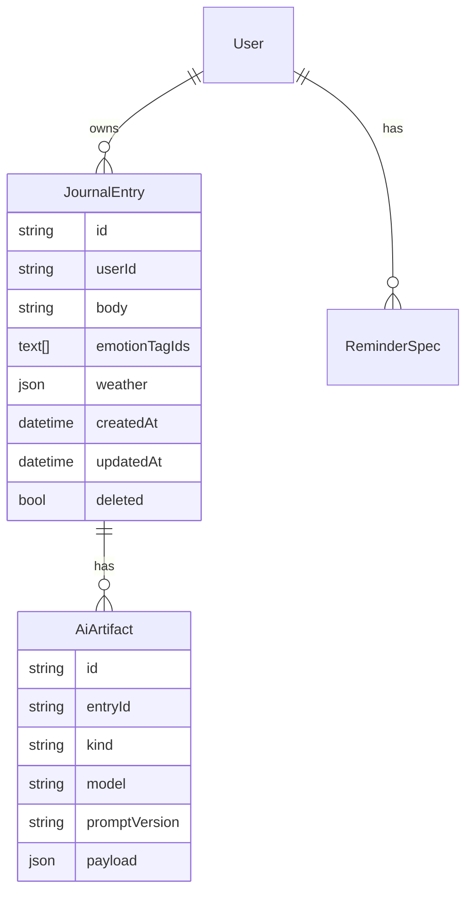

# First Launch — 네이티브 첫 론칭 로드맵

> 네이티브 앱 + AI + 데이터 보존을 전제로 한 **결정 기록**입니다. 예전에는 9개 파일(마스터 1 + 카테고리 8)로 나뉘어 있었는데, 다 같은 주제의 조각이라 파일을 옮겨 다니는 비용이 내용 자체보다 컸습니다. 이제 한 파일이니 **Cmd+F로 검색**하거나 아래 목차로 이동하세요. Figma/Next 쪽 [src/app/](../src/app/) UI는 레퍼런스로 유지.
>
> 백로그 태그(`AUTH`, `EMPTY-UI` 등)는 [PROGRESS_CHECKLIST.md 용어](./PROGRESS_CHECKLIST.md#용어--2026-07-11부터-이-이름으로-부릅니다) 참고 — 2026-07-11부터 `C-1`/`H-3` 같은 코드 대신 기능 이름을 씁니다.

## 목차

- [기능적 흐름](#기능적-흐름)
- [상태 표](#상태-표)
- [지금 진행 중 — 기록 저장 플로우](#지금-진행-중--기록-저장-플로우-웹-프로토타입)
- [01 범위 결정](#01-범위-결정) · [02 모바일 스택·위젯 전략](#02-모바일-스택위젯-전략) · [03 백엔드 아키텍처](#03-백엔드-아키텍처) · [04 데이터 모델](#04-데이터-모델)
- [05 AI 파이프라인](#05-ai-파이프라인) · [06 푸시·리마인더](#06-푸시리마인더) · [07 위젯·빠른 기록](#07-위젯빠른-기록) · [08 타임라인·회고 UI](#08-타임라인회고-ui)
- [코드](#코드) · [문서·구현 동기화 규칙](#문서구현-동기화-규칙)

전체 문서 지도는 [../README.md](./README.md) 참고. 지금 뭐부터 해야 하는지는 이 문서가 아니라 [PROGRESS_CHECKLIST.md](./PROGRESS_CHECKLIST.md)(유일한 우선순위 소스)를 본다.

## 기능적 흐름

01~08은 읽는 순서가 아니라 **서로 위에 얹히는 의존 관계**로 붙은 번호입니다.

```
[01] 범위 결정 (1.0 / 1.1)
        │  "뭘 먼저 만들지"
        ▼
[02] 모바일 스택 결정 ─────────────────┐
        │  "어떤 기술로"                  │
        ▼                               │
[03] 백엔드 아키텍처                     │
   Auth · API · DB · 동기화              │
        │  "데이터를 어떻게 주고받을지"     │
        ▼                               ▼
[04] 데이터 모델 ◄───────────────[07] 위젯·빠른 기록 (1.1)
 JournalEntry · AiArtifact          (동일 API 계약 공유)
        │
        │  "쌓인 데이터로 뭘 할지" — 세 갈래
        ├───────────────────┬───────────────────┐
        ▼                   ▼                   ▼
 [05] AI 파이프라인    [06] 푸시·리마인더    [08] 타임라인·회고 UI
  (원문 보존 원칙)        (다시 불러오기)        (다시 보여주기)
```

**읽는 법:** `01`이 범위를 정하면 `02`가 그 범위를 구현할 기술을 정하고, `03`이 그 기술 위에 서버를 짓습니다. `04`의 데이터 모델은 `03`의 산출물이자 `05`·`06`·`08` 세 기능이 공통으로 참조하는 기반입니다. `07`(위젯)은 `02`·`03`에서 이미 정한 스택·API 계약을 그대로 재사용합니다.

## 상태 표

| # | 문서 | 상태 | 한 줄 요약 | 관련 백로그 |
|---|---|---|---|---|
| 01 | [범위 결정](#01-범위-결정) | 🟢 완료 | 1.0 필수 경로 / 1.1 확장 범위 확정 | — |
| 02 | [모바일 스택·위젯 전략](#02-모바일-스택위젯-전략) | ⚪ 대기 | Expo prebuild 권장, 네이티브 미착수 | `NATIVE-APP`, `WIDGET` |
| 03 | [백엔드 아키텍처](#03-백엔드-아키텍처) | 🟡 진행중 | API 스캐폴딩·오프라인 동기화(`SYNC`) 완료, 인증·보안·데이터 삭제 미완 | `AUTH`, `SECURITY-HARDENING`, `DATA-INTEGRITY`, `SYNC-LIVE` |
| 04 | [데이터 모델](#04-데이터-모델) | 🟢 완료 | JournalEntry·AiArtifact 스키마 확정 | — |
| 05 | [AI 파이프라인](#05-ai-파이프라인) | ⚪ 대기 | `enqueueAiJob` 스텁만 존재 | `AI-PIPELINE`, `REFLECTION-UI` |
| 06 | [푸시·리마인더](#06-푸시리마인더) | ⚪ 대기 | DB 테이블만 존재, 발송 미구현 | `PUSH-NOTIFICATION` |
| 07 | [위젯·빠른 기록](#07-위젯빠른-기록) | ⚪ 대기 | API 계약만 존재, 위젯 자체 미착수 | `NATIVE-APP`, `WIDGET` |
| 08 | [타임라인·회고 UI](#08-타임라인회고-ui) | 🟡 진행중 | 타임라인 UI 구현됨, 회고 카드 미완 | `REFLECTION-UI` |

범례: 🟢 완료 · 🟡 진행중 · ⚪ 대기. **상태 갱신은 각 섹션 상단의 상태 줄에서**, 백로그 우선순위 변경은 [PROGRESS_CHECKLIST.md](./PROGRESS_CHECKLIST.md)에서만 합니다.

---

## 지금 진행 중 — 기록 저장 플로우 (웹 프로토타입)

01~08의 "첫 론칭 결정 기록"과는 별개로, 지금 실제로 굴러가는 웹 프로토타입의 **핵심 플로우(기록 입력 → 저장 → 동기화)** 진행 상태입니다. 코드 레벨 근거·전체 아키텍처는 [PROGRESS_CHECKLIST.md 부록 A](./PROGRESS_CHECKLIST.md#부록-a--저장-흐름-병목-auth-근거).

```
기록 입력 → 저장 → 동기화
   ████████████████████████████████░░░░░░░░  5 / 7 완료
```

| 마일스톤 | 상태 | 한 줄 |
|---|---|---|
| 로컬 우선 저장 (동기) | ✅ | `localStorage` 즉시 반영, 네트워크 상태와 무관 |
| 서버 동기화 (비동기 best-effort) | ✅ | `postQuickEntry()` → `POST /v1/entries/quick` |
| `SAVE-GUARD` — 저장 중 중복 클릭 방지 | ✅ | `isSaving` 가드 + 버튼 `disabled` + "저장 중..." 라벨 |
| `SAVE-ERROR-TOAST` — 네트워크 실패 토스트 | ✅ | 실패 시 `ToastMessage`로 즉시 안내 |
| **`SYNC` — 오프라인 재시도 + 멱등 처리** | ✅ 신규 (2026-07-11) | 로컬 기록에 `synced` 플래그를 두고 미전송 건을 추적 → 앱 시작·`online` 이벤트 시 `syncPendingRecords()`가 재전송. 서버는 클라이언트가 보낸 `clientMutationId`로 기존 upsert(동시 경합 시 unique 충돌도 기존 row 반환)해 **같은 기록이 두 번 저장되지 않도록** 멱등 처리 |
| `AUTH` — 서버 실사용자 인증 연결 | 🔴 | `X-Dev-Email` 개발용 헤더만 동작 — JWT 전환 전까지 실사용자 동기화 불가 (`AUTH`, `SYNC-LIVE`) |
| `EMPTY-UI` — 피드 빈 상태 UX | 🔴 | 기록 0건일 때 안내 화면 없음 |

**남은 순서:** `EMPTY-UI`(빈 상태) → `ACCESSIBILITY`(a11y) → `AUTH`(인증) → `SYNC-LIVE`(인증 완료 후 실사용자 동기화 활성화). 근거는 [PROGRESS_CHECKLIST.md 다음 스프린트 제안](./PROGRESS_CHECKLIST.md#다음-스프린트-제안-우선순위-기준).

---

## 01 범위 결정

> **상태: 🟢 완료** — 범위 결정 채택됨. 실행 진행 상황은 아래 02~08과 [PROGRESS_CHECKLIST.md](./PROGRESS_CHECKLIST.md)에서 추적.

**권장: 스토어 "첫 론칭"을 두 갈래로 나누되, 사용자에게는 하나의 제품으로 연속 배포.**

| 구분 | 포함 기능 | 목적 |
|------|-----------|------|
| **1.0 (필수 경로)** | 계정·동기화·마이크로 저널·감정 태그·기본 리마인더(로컬/푸시)·AI 통계·회고 **텍스트** (비동기 처리) | 데이터가 쌓이고, AI가 "원문을 대체하지 않는" 경험 검증 |
| **1.1 (확장)** | **홈 화면 위젯** 빠른 기록, **시각적 타임라인** 고도화(썸네일·레이아웃), **AI 리마인더 문구** 고도화 | 위젯/비주얼은 스토어 심사·OS별 개발량이 크므로 분리 |

### 네 가지 "필수 기능" 매핑

1. **앱 밖 순간 기록 (위젯·푸시)**
   - 1.0: 푸시 탭 → 앱 딥링크 작성, **짧은 리마인더 스케줄** (서버 스펙 + 클라이언트 실행).
   - 1.1: iOS WidgetKit / Android App Widget **네이티브 구현**.
2. **AI 기록 통계·리마인더**
   - 1.0: 서버 배치 집계 + 푸시/로컬 알림 파이프라인.
   - 1.1: 개인화 규칙·LLM 한 줄 카피 강화.
3. **마이크로 저널링·감정 태깅** — **1.0에 전부 포함** (핵심 데이터 모델).
4. **AI 시각적 타임라인·회고**
   - 1.0: **회고 카드(텍스트) + 리스트/피드** 수준.
   - 1.1: "시각적" 강화(이미지 메타·타임라인 전용 뷰).

### 대안: "진짜로 한 버전에 네 가지 풀스펙"

가능은 하나, **캘린더 일정이 2~3배**로 늘어나는 경우가 많음. 병렬로 **법무/백엔드/네이티브** 인력을 나눌 수 있을 때만 권장.

**구현 이력** — Next 웹 프로토타입 [`src/app`](../src/app/) 기준 누적, 최신이 위:

- **2025-03-24** — 마이크로 저널 웹: 텍스트·감정·할 일·로컬 저장 + 선택 `remind-api` 동기화. 추가로 기록하기 상단 당일 날씨·대략 위치 표시, 저장 시점 날씨 스냅샷을 기록에 부착 → 모아보기 피드에서 한 줄로 확인 가능(1.0 필수 경로와 독립적인 UX). 네이티브 1.0 범위표는 변경 없음; 웹은 검증용 레퍼런스.

## 02 모바일 스택·위젯 전략

> **상태: ⚪ 대기** — 스택 결정은 완료(Expo prebuild). 실제 네이티브 착수는 아직 (`native/` 플레이스홀더만, [PROGRESS_CHECKLIST.md](./PROGRESS_CHECKLIST.md) `NATIVE-APP`).

**React Native + Expo (prebuild / development builds)**

- JS/TS 생태계와 기존 디자인 토큰(JSON) 공유가 쉬움.
- **위젯·Share Extension·푸시**는 네이티브 타깃이 필요 → Expo **Config Plugin** 또는 **bare** 브리지로 확장.
- **권장안: Expo prebuild + 네이티브 확장** (세부 버전은 `native/` 앱 생성 시 `package.json`에 고정).

### 위젯 전략

| 플랫폼 | 접근 | 비고 |
|--------|------|------|
| iOS | WidgetKit **별도 Extension** 타깃 | App Group + 동일 API로 동기화 |
| Android | `AppWidgetProvider` + RemoteViews | 데이터는 API + 로컬 캐시 |

Expo만으로 위젯을 "완전 관리형"으로 쓰기 어렵기 때문에, **초기부터 prebuild**로 네이티브 폴더를 열어두고, 위젯 모듈을 **단계적으로 추가**하는 것을 권장.

### Flutter 대안

팀이 Dart에 강하면 Flutter도 가능. 위젯/푸시 패턴은 동일하게 **네이티브 모듈**이 필요.

관련 코드: [native/README.md](../native/README.md)

**구현 이력** — 웹 레퍼런스 앱과 네이티브 이전 시 맞출 포인트, 최신이 위:

- **2025-03-24** — 위치·날씨(웹): `navigator.geolocation` + 서버 프록시 `GET /api/weather` (키는 서버 env만). 크롬은 HTTPS/localhost에서 권한 필요. 네이티브 이전 시: iOS/Android 각각 위치 권한·백그라운드 정책, 위젯에서는 좌표 캐시 또는 짧은 API 호출로 동일 스냅샷(`StoredWeatherSnapshot` 형태)을 맞추면 `POST /v1/entries/quick`과 호환 가능.

## 03 백엔드 아키텍처

> **상태: 🟡 진행중** — API 스캐폴딩·보안 가드·오프라인 동기화(`SYNC`, 재시도+멱등)는 완료, 인증(`AUTH`)·서버 보안 강화(`SECURITY-HARDENING`)·데이터 삭제·무결성(`DATA-INTEGRITY`)은 미완 ([PROGRESS_CHECKLIST.md](./PROGRESS_CHECKLIST.md)).

- **API**: HTTPS JSON API (권장: Fastify 또는 Nest).
- **DB**: PostgreSQL (Prisma 스키마: [server/prisma/schema.prisma](../server/prisma/schema.prisma)).
- **Auth**: 액세스 토큰 + 리프레시 또는 세션 쿠키(모바일은 Bearer 권장). 비밀번호는 해시만 저장 (Argon2/bcrypt).
- **객체 저장**: 이미지/첨부가 생기면 S3 호환 버킷 (1.0에서는 생략 가능).
- **작업 큐**: Redis + BullMQ (AI 잡·집계) — [server/src/jobs/ai-queue.ts](../server/src/jobs/ai-queue.ts) 스텁.

### 동기화 (`SYNC` / `SYNC-LIVE`)

- **`SYNC` 웹 프로토타입: 구현 완료 (2026-07-11).** `localStorage` 자체를 아웃박스로 써서 `synced: false`인 기록을 앱 시작·`online` 이벤트 시 재전송(`syncPendingRecords()`), 서버는 `clientMutationId` 기준 멱등 upsert. 코드 레벨 근거는 [PROGRESS_CHECKLIST.md 부록 A](./PROGRESS_CHECKLIST.md#부록-a--저장-흐름-병목-auth-근거) 참고.
- **`SYNC-LIVE` 진행중 (1/8, 2026-07-13).** 로그아웃/재로그인(다른 계정) 시 로컬 데이터 무효화 정책을 [`src/app/lib/session.ts`](../src/app/lib/session.ts)로 구현 — identity가 바뀌면 `memoryCache`·`localStorage` 기록을 지워 이전 계정 기록이 새 계정에 노출되지 않도록 함. 나머지 7개(`Authorization: Bearer` 교체, 로컬→서버 최초 업로드 온보딩 등)는 실 로그인(`AUTH`) 구현 이후로 대기.
- **네이티브 이전 시:** 위 패턴을 그대로 유지하되 저장소만 로컬 DB(SQLite/Watermelon 등)로 교체하면 됨 — `synced` 플래그·`clientMutationId` 멱등 계약은 이미 서버·클라이언트 양쪽에 있으므로 API 재사용 가능.

### 보안 (`SECURITY-HARDENING`)

- **진행중 (7/15, 2026-07-11).** `상시 보안 방어`/`배포 전 체크리스트` 두 섹션으로 분리 관리. 상시 보안 방어 7/10 완료: `@fastify/helmet`(보안 헤더 + HSTS), `@fastify/rate-limit`(100req/분), `bodyLimit` 명시(1MB), `DevicePushToken.token` 길이 제한, 환경변수 재감사, `npm audit fix`(high 6건 해결). 배포 전 체크리스트 5개(`CORS_ORIGIN`·`ALLOW_DEV_AUTH`·로그 레벨·로그 샘플링 테스트·HSTS 프로덕션 검증)는 전부 실제 배포 환경 접근이 필요해 대기.
- 실행용 상세 체크리스트: [PROGRESS_CHECKLIST.md 부록 C § SECURITY-HARDENING](./PROGRESS_CHECKLIST.md#security-hardening--서버-보안-강화).

### 데이터 삭제·무결성 (`DATA-INTEGRITY`)

- **진행중 (1/10, 2026-07-13).** `DELETE /v1/entries/:id` 소프트 삭제 엔드포인트 구현 — `JournalEntry.deleted`만 세팅, `body`는 건드리지 않음. 소유권 검증(다른 사용자 소유면 404), 이미 삭제된 건 재호출해도 멱등하게 200. `server/src/app.test.ts`(vitest, in-memory Prisma 대역)로 401/404/삭제 성공+body 불변/소유권/멱등 5개 케이스 검증. 나머지(삭제 UI, 계정 삭제 정책, export, `body` 불변성 강제 가드, 백업 검증)는 대기.
- 실행용 상세 체크리스트: [PROGRESS_CHECKLIST.md 부록 C § DATA-INTEGRITY](./PROGRESS_CHECKLIST.md#data-integrity--데이터-삭제무결성-보장).

### 백업

- DB **자동 스냅샷** + **PITR** 가능한 호스팅(RDS, managed Postgres) 권장 — 실제로 설정·복구 검증됐는지는 `DATA-INTEGRITY` 체크리스트 항목.
- 앱 내 "내보내기"는 1.x로도 가능 (`DATA-INTEGRITY`).

### 로컬 실행

[server/README.md](../server/README.md) 참고.

**구현 이력** — Phase 1 API·Next 앱 연동, 최신이 위:

- **2026-07-13** — 디자인 제외 백엔드·데이터 안정화 3건. `SYNC-LIVE`: 로그아웃/재로그인 시 로컬 데이터 무효화(`src/app/lib/session.ts`, `ensureIdentityConsistency()`/`logout()`/`loginAs()`). `DATA-INTEGRITY`: `DELETE /v1/entries/:id` 소프트 삭제 구현 — 테스트 가능하도록 `server/src/index.ts`(부트스트랩)에서 `server/src/app.ts`(`buildApp()`, 라우트 전체)를 분리하고 `vitest` 도입, in-memory Prisma 대역으로 5개 케이스 작성·통과(`server/src/app.test.ts`). `AUTH`: dev-placeholder 계정 데이터를 실사용자 계정으로 옮기는 마이그레이션 전략 초안 [`data-migration.md`](./data-migration.md) 작성.
- **2026-07-11** — `SECURITY-HARDENING`을 `상시 보안 방어`/`배포 전 체크리스트` 2섹션으로 재분류, 신규 3건(에러 응답 보안·HSTS·로그 샘플링 테스트) 추가, 배포 보안 체크 워크플로우 3단계 작성. HSTS는 `@fastify/helmet` 기본값에 이미 포함돼 있어 완료 처리. 현재 7/15(상시 7/10 + 배포 전 0/5).
- **2026-07-11** — `SECURITY-HARDENING` 6/11 완료: `server/package.json`에 `@fastify/helmet`·`@fastify/rate-limit` 추가, `server/src/index.ts`에 등록(헤더 미들웨어, 100req/분 레이트 리미팅, `bodyLimit: 1MB` 명시). `pushTokenSchema.token`에 `.max(512)`. 환경변수 재감사(커밋된 시크릿 없음 확인). `npm audit fix`로 high 취약점 6건 해결(defu, effect/@prisma, fast-uri, fastify — 남은 1건은 low·Windows dev 전용이라 보류). `/health` 응답으로 헤더·레이트리밋 헤더 실동작 확인.
- **2026-07-11** — 코드 감사로 `SECURITY-HARDENING`(레이트 리미팅·보안 헤더 부재), `DATA-INTEGRITY`(삭제 엔드포인트 부재, `deleted` 필드 미사용) 두 백로그 항목 신설. [PROGRESS_CHECKLIST.md](./PROGRESS_CHECKLIST.md) 참고.
- **2026-07-11** — `SYNC`(오프라인 동기화 큐): `recordsStore.ts`에 `synced?: boolean` 필드(스키마 v2, 마이그레이션 포함) + `getUnsyncedRecords()`/`markRecordSynced()`. `remindApi.ts`에 `syncPendingRecords()`(순차 처리, 첫 실패 시 중단) + `postQuickEntry()`가 `clientMutationId` 전송. `page.tsx`가 앱 마운트·`online` 이벤트 시 재시도 트리거. 서버는 `clientMutationId` 기준 `findUnique` 후 없으면 `create`, 동시 경합(P2002)도 기존 row 반환하도록 처리(`server/src/index.ts`).
- **2026-04-17** — 프로덕션 가드: `NODE_ENV=production` && `ALLOW_DEV_AUTH !== "true"` → `process.exit(1)`. 실수로 dev auth를 프로덕션에 배포하면 즉시 종료. `server/.env.example`에 `ALLOW_DEV_AUTH` 주석 경고 추가. CORS 환경변수 제한: `CORS_ORIGIN` 환경변수 도입, 프로덕션은 지정 도메인만 허용. `resolveDevEmail()` 헬퍼로 3개 라우트의 `X-Dev-Email` 추출 코드 중앙화(`AUTH` 전환 시 이 함수만 수정). `// TODO: X-Dev-Email → JWT/session으로 교체 필요` 주석 삽입, 완료 기준은 실 유저 세션 발급·검증.
- **2025-03-24** — Next 앱 라우트: `GET /api/weather?lat=&lon=` (OWM + 선택 카카오 역지오코딩, `OPENWEATHERMAP_API_KEY`/`KAKAO_REST_API_KEY`는 서버 전용 `.env.local`). remind-api: `POST /v1/entries/quick` 본문에 선택 `weather` 객체(`location`,`temp`,`extra`,`icon`,`weatherId`), Prisma `JournalEntry.weather`(`Json?`), 마이그레이션 `server/prisma/migrations/20250324120000_journal_entry_weather/`. 동기화: 클라이언트는 로컬 `StoredRecord`에 스냅샷을 먼저 저장 후, API URL 설정된 경우에만 서버 전송.

## 04 데이터 모델

> **상태: 🟢 완료** — 스키마 확정 (`JournalEntry`, `AiArtifact`, `ReminderSpec`, `DevicePushToken`). 필드 추가 시 이 섹션과 `schema.prisma`를 함께 갱신.

런타임 소스: [src/types/journal.ts](../src/types/journal.ts)



### 감정 태그

- `emotionTagIds`는 **버전된 카탈로그** ID를 참조 (카탈로그 테이블 또는 JSON 정의).
- 기존 웹 [StoredRecord](../src/app/lib/recordsStore.ts)는 마이그레이션 시 `JournalEntry`로 매핑.

### 웹 로컬 스냅샷 (날씨)

- [StoredRecord](../src/app/lib/recordsStore.ts)에 선택 **`weather`**: `StoredWeatherSnapshot` (`location`, `temp`, `extra`, `icon`, 선택 `weatherId`) — 기록 저장 시 상단 날씨 블록과 동기화.
- 서버 `JournalEntry.weather`와 필드 의미를 맞추면 동기화·백업 시 손실 없이 옮길 수 있음.

스키마 원본: [server/prisma/schema.prisma](../server/prisma/schema.prisma)

**구현 이력** — 스키마·로컬 타입 정합, 최신이 위:

- **2025-03-24** — Prisma `JournalEntry.weather`(`Json?`) 추가. 웹 `StoredRecord.weather`/`StoredWeatherSnapshot` 추가, 피드 목록에서 텍스트 위에 날씨 한 줄 표시. 위 ERD의 `json weather` 반영.

## 05 AI 파이프라인

> **상태: ⚪ 대기** — `enqueueAiJob()`은 로그만 남기는 스텁 ([PROGRESS_CHECKLIST.md](./PROGRESS_CHECKLIST.md) `AI-PIPELINE`). 실제 LLM 연동 전.

### 원칙 (보존형)

1. **원문(`JournalEntry.body`)은 항상 DB에 유지** — AI는 삭제/대체 권한 없음.
2. **산출물은 `AiArtifact`** (`kind`: `summary` | `weekly_stats` | `reflection_card` 등).
3. **옵트인**: 설정에서 "AI 분석 허용" 후에만 LLM 호출.
4. **재시도**: 큐 실패 시 exponential backoff; 사용자에게 "처리 중/실패" 상태.

### 흐름

1. `JournalEntry` 생성/수정 → `enqueueAiJob({ entryId, kind })`.
2. Worker가 LLM 호출 → 결과를 `AiArtifact`에 저장 (`model`, `promptVersion` 기록).
3. 클라이언트는 API로 아티팩트만 조회.

구현 참고: 스텁 [server/src/jobs/ai-queue.ts](../server/src/jobs/ai-queue.ts) · 환경 변수 `OPENAI_API_KEY` 등(서버 전용, 클라이언트에 넣지 않음)

**구현 이력** — AI 원칙과의 관계만 기록, 최신이 위:

- **2025-03-24** — 날씨 메타데이터(`JournalEntry.weather`, 로컬 `StoredRecord.weather`)는 원문 `body`와 분리된 스냅샷이며, AI가 원문을 대체하지 않는다는 원칙과 충돌 없음. 향후 프롬프트에 "당시 날씨"를 넣을지는 옵트인 정책에서 별도 결정.

## 06 푸시·리마인더

> **상태: ⚪ 대기** — `DevicePushToken`, `ReminderSpec` 테이블만 존재, 실제 발송 미구현 ([PROGRESS_CHECKLIST.md](./PROGRESS_CHECKLIST.md) `PUSH-NOTIFICATION`).

- **디바이스 토큰**: `DevicePushToken` (APNs / FCM) — 사용자·기기별.
- **리마인더 스펙**: `ReminderSpec` — 시각, 타임존, 반복 규칙, 활성 여부.
- **실행**: 서버가 "보낼 시점"을 계산하거나, 클라이언트가 **로컬 알림**만 쓰는 하이브리드.
- **보안**: 푸시 페이로드에 **원문 전체** 금지 (짧은 프리뷰 또는 "기록 열기"만).
- **환경 변수**: `server/.env.example` 참고.

**구현 이력** — 해당 영역 코드 변경이 있을 때만 기록, 최신이 위:

- **2025-03-24** — (없음) 푸시·리마인더 스펙 또는 구현 변경 없음.

## 07 위젯·빠른 기록

> **상태: ⚪ 대기** — API 계약(`source: widget|share`)만 존재, 네이티브 위젯 자체는 미착수 ([PROGRESS_CHECKLIST.md](./PROGRESS_CHECKLIST.md) `WIDGET`, 전제 조건 `NATIVE-APP`). 1.1 권장 영역.

- `POST /v1/entries/quick` — 짧은 본문, `source: widget|share|notification`.
- **선택 필드 `weather`:** 앱 기록하기와 동일 스키마 (`location`, `temp`, `extra`, `icon`, 선택 `weatherId`) — 위젯에서 날씨를 알고 있으면 함께 보내 서버·로컬과 정합.

### iOS

- **WidgetKit** Extension (앱 본체와 별도 타깃).
- **App Group**에 최소 메타데이터 캐시 + 필요 시 API 동기화.
- **Share Extension**: 다른 앱에서 공유 → 동일 API.

### Android

- **AppWidget** + `RemoteViews`.
- 백그라운드 제약 고려 → **짧은 입력은 API로 즉시 전송**, 실패 시 큐.

전제 스택은 [02](#02-모바일-스택위젯-전략), 공유 API 계약은 [03](#03-백엔드-아키텍처) 참고. 코드: [native/README.md](../native/README.md)

**구현 이력** — 퀵 엔트리 계약, 최신이 위:

- **2025-03-24** — 본문 스키마 확장: `POST /v1/entries/quick`에 `weather` 선택 추가(웹 `postQuickEntry`와 동일). 위젯/공유 진입점에서 향후 동일 필드 사용 가능.

## 08 타임라인·회고 UI

> **상태: 🟡 진행중** — 웹 프로토타입 타임라인 UI는 상당 부분 구현됨(2026-04-01 이력), AI 회고 카드는 미완 ([PROGRESS_CHECKLIST.md](./PROGRESS_CHECKLIST.md) `REFLECTION-UI`).

- **타임라인**: `JournalEntry` 목록 + `AiArtifact` 중 `reflection_card` / `timeline_summary`.
- **페이지네이션**: `cursor` 기반 (createdAt + id).

### UI 계약 (클라이언트)

- 타임라인 아이템: [JournalTimelineItem](../src/types/journal.ts) 타입 참고.
- "시각적" 강화(1.1): 썸네일 URL, 테마 컬러는 `AiArtifact.payload`에만 의존하지 말고 **엔트리 메타**와 분리.

### 캐시

- 이미지/썸네일은 CDN/객체 스토리지 URL + `Cache-Control`.

데이터 출처: [04](#04-데이터-모델), [05](#05-ai-파이프라인)

**구현 이력** — UI·데이터 계약 보완, 최신이 위:

- **2026-04-01** — 타임라인 인터페이스(웹 프로토타입): 모아보기 기본 화면을 타임라인으로 전환, 상단 방향 토글(가로/세로, 기본 가로). 가로 스와이프 카드와 하단 dot-라인 타임라인 동기화(현재 카드 dot가 뷰포트 중앙). dot 표현 규칙: 월 경계(`day=1`)는 크고 강한 색, 주 경계(월요일)는 중간 강도. 방향 전환 시 로딩 스켈레톤. 하단 dot를 기록 개수가 아닌 1년(365일) 날짜 기준으로 재구성, 좌우 여백 없이 화면 끝까지. 트랙패드 수평 제스처를 컨테이너 내부 스크롤로 소비해 OS/브라우저 외부 스와이프 충돌 완화. 하단 타임라인 시각 정리(`과거/미래` 텍스트·배경·상단 보더 제거). 네이티브 가로 스크롤 대신 카드 인덱스 슬라이더(드래그 오프셋 기반)로 전환, 포인터 이벤트를 카드 래퍼에만 연결해 카드 바깥 스와이프 차단. 주 단위 `MM/DD` 라벨, 연도 경계 `YYYY` 라벨. 현재 카드는 중앙 100% 불투명, 이전/다음 카드는 좌우 40px만 노출(70% 불투명). 카드 트랙 step을 FeedPage 루트 뷰포트 기준으로 재계산, 클리핑되는 `main` 뷰포트 폭 기준으로 피크 노출 보정. 카드 상단 `DateLabel` 제거 후 카드 내부로 이동, `FeedRecordCard`/`Card2LineVer`에 날짜+저장된 날씨(`time + icon + weatherLine`) 표출. `BottomNavBar` 제거, 하단 dot 타임라인을 feed 메인 뷰포트 하단 고정(`absolute bottom`)으로 이동. 하단 타임라인 컨테이너 높이 `64px`(`h-16`) 고정, 가로 제스처(`pan-x`)·오버스크롤 처리 명시. 하단 dot/line/label 렌더링을 `FeedTimelineDots` 컴포넌트로 분리. 기록 있는 날짜 dot `12px`, 기본 `8px`(`--spacing12`/`--spacing8` 토큰).
- **2025-03-24** — 엔트리 메타: 서버·로컬에 저장되는 날씨 스냅샷(`weather`)은 타임라인 카드에서 "당시 컨텍스트"로 표시하기 좋음(웹 피드는 한 줄 텍스트로만 노출). 1.1 시각적 타임라인 설계 시 아이콘·온도·위치를 카드 메타로 매핑 가능.

---

## 코드

- **공유 타입**: [src/types/journal.ts](../src/types/journal.ts)
- **API 서버 (Phase 1 스캐폴드)**: [server/README.md](../server/README.md)

## 문서·구현 동기화 규칙

각 번호 섹션(01~08) **끝**에 `구현 이력` 블록을 두고, **완료·진행된 기능**을 날짜별로 누적합니다. 기능이 머지될 때마다 (1) 아래 요약 표에 한 줄 또는 새 날짜 블록을 추가하고, (2) 관련 섹션의 구현 이력에 핵심만 bullet로 남깁니다. 과거 항목은 지우지 않고 위에 새 날짜를 쌓습니다.

| 시점 | 요약 |
|------|------|
| **2026-07-11** | 디자인 제외 최우선·최단시간 태스크 6건 처리: 서버 보안 헤더(`@fastify/helmet`)·레이트 리미팅(`@fastify/rate-limit`)·`bodyLimit` 명시·`DevicePushToken` 길이 제한·환경변수 재감사·`npm audit fix`(`SECURITY-HARDENING` 6/11), ESC 닫기+포커스 복귀·텍스트 영역 레이블·토스트 `aria-live` 안정화(`ACCESSIBILITY` 3/8). 전부 로컬에서 동작 확인. |
| **2026-07-11** | 코드 감사로 보안·데이터 무결성 공백 발견 — `SECURITY-HARDENING`(레이트 리미팅·보안 헤더 없음), `DATA-INTEGRITY`(삭제 기능 없음, `body` 불변성 미강제) 두 항목을 백로그에 신설. |
| **2026-07-11** | 백로그 라벨 체계를 `C-1`/`H-3`/`M-1` 같은 코드에서 `AUTH`/`EMPTY-UI`/`ACCESSIBILITY` 같은 기능 이름으로 전환. 매핑은 [PROGRESS_CHECKLIST.md 용어](./PROGRESS_CHECKLIST.md#용어--2026-07-11부터-이-이름으로-부릅니다) 참고. |
| **2026-07-10** | first-launch 문서를 파일 9개(마스터 1 + 01~08)에서 **이 파일 1개**로 통합. 탐색 비용(파일 전환 횟수)을 줄이는 게 목적 — 내용은 그대로, 구조만 앵커 섹션으로 재배치. |
| **2026-04-17** | **프로젝트 규칙 확립** (`CLAUDE.md`). **보안 4건** 수정 (서버 프로덕션 가드, CORS 환경변수 제한, localStorage 스키마 버전 관리, 토큰 CSS 경고 주석). **내비게이션 구조 개편** — BottomNavBar 제거, 1depth 전 화면에 FAB 추가(새 기록), 피드 CTA 버튼 FAB로 통합. **Segment Control 아이콘화** — 가로/세로 전환 버튼을 SVG 아이콘으로 교체. |
| **2026-04-01** | 모아보기를 **타임라인 기본 화면**으로 전환. 방향 토글(가로/세로), 가로 스와이프 카드와 하단 dot-라인 동기화(활성 dot 중앙 정렬) 추가. |
| **2025-03-24** | 기록하기 **실시간 날씨·역지오코딩** (`/api/weather`), **저장 시 날씨 스냅샷** (로컬 + `POST /v1/entries/quick` + `JournalEntry.weather`), 피드 한 줄 표시. 상세는 각 섹션 구현 이력 참고. |
