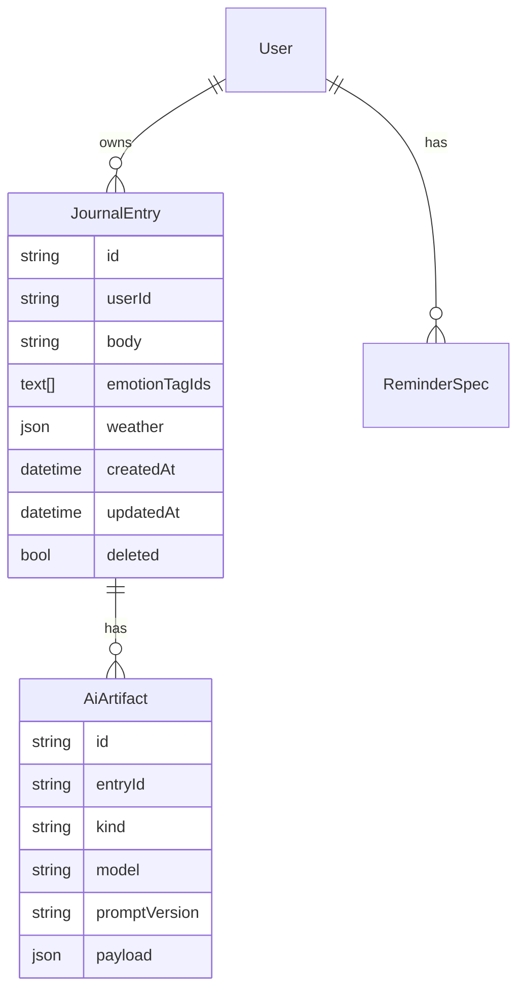

# 데이터 모델 (마이크로 저널·감정·AI)

## TypeScript 공유 타입

런타임 소스: [src/types/journal.ts](../../src/types/journal.ts)

## 엔티티 관계 (요약)

## 감정 태그

- `emotionTagIds`는 **버전된 카탈로그** ID를 참조 (카탈로그 테이블 또는 JSON 정의).
- 기존 웹 [StoredRecord](../../src/app/lib/recordsStore.ts)는 마이그레이션 시 `JournalEntry`로 매핑.

## 웹 로컬 스냅샷 (날씨)

- [StoredRecord](../../src/app/lib/recordsStore.ts)에 선택 **`weather`**: `StoredWeatherSnapshot` (`location`, `temp`, `extra`, `icon`, 선택 `weatherId`) — 기록 저장 시 상단 날씨 블록과 동기화.
- 서버 `JournalEntry.weather`와 필드 의미를 맞추면 동기화·백업 시 손실 없이 옮길 수 있음.

---

## 구현 이력 (레포 동기화)

스키마·로컬 타입 정합. (최신이 위.)

### 2025-03-24

- **Prisma:** `JournalEntry.weather` (`Json?`) 추가.
- **웹:** `StoredRecord.weather` / `StoredWeatherSnapshot` 추가; 피드 목록에서 텍스트 위에 날씨 한 줄 표시.
- **다이어그램:** 위 `JournalEntry` 블록에 `json weather` 반영.
